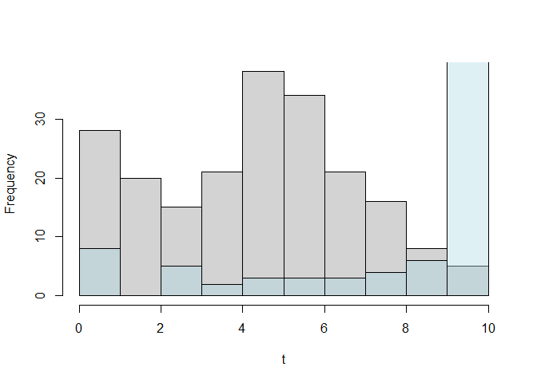

<!-- README.md is generated from README.Rmd. Please edit that file -->

# SplineHazardRegression

<!-- badges: start -->
<!-- badges: end -->

There is no R software available for the direct estimation of hazards
with uncertainty estimation (confidence intervals).

The primary goal of SplineHazardRegression is to make available the
methods for flexible estimation of hazards using (cubic) b-splines
published in Philip S. Rosenberg. “Hazard Function Estimation Using
B-Splines” In Biometrics, Vol. 51, No. 3 (Sep., 1995), pp. 874-887
<https://doi.org/10.2307/2532989> The input data is time-to-event data
(e.g. time to death), possibly right-censored and with late entries
(both meaning that patients are followed-up for unequal times).

The package also allows the flexible estimation of the cumulative hazard
and cumulative survival functions, as well as the compuatation of
aggregate measures for those (average, median, interquartile range,
etc).

Different methods for the automatic selection of knots and for variance
estimation are implemented.

## Installation

You can install the development version of SplineHazardRegression from
[GitHub](https://github.com/) with:

``` r
# install.packages("devtools")
devtools::install_github("fespuny/SplineHazardRegression")
```

## Example

This is a basic example which shows you how to simulate time-to-event
data and fit a hazard function, deriving then cumulative hazard and
survival estimates.

### Data Simulation

``` r
library(SplineHazardRegression)
## simulation parameters
   knots = c(0, 1, 3, 6, 10, NA, NA)
   betac = 1 * c(0.05, 0.05, 0.05, 0.05, 0.40, 0.1, 0.05)
   HParm = data.frame(knots, betac) # 'A Simple B-Spline'
   cll = c(0, 5)
   cup = c(5, 10)
   cih = c(0.0125, 0.025)
   CParm = data.frame(cll, cup, cih) # 'Light Censoring'
## calculate simulation true hazard and censoring distributions
   INPUTS = etsim_inputs( HParam=HParm, CParam=CParm, SampleSize = 201 )
## simulate time-to-event data using true distribution
   SimDat = etsim(INPUTS)
## histogram of the fully observed hazard data (gray) and censored observations (light blue)
hist( SimDat$time[ which(SimDat$status==1)], main="", xlab="t", breaks="Freedman-Diaconis", xlim=c(0,10) )
hist( SimDat$time[ which(SimDat$status==0)], main="", xlab="t", breaks="Freedman-Diaconis", xlim=c(0,10),add=TRUE, col=rgb(173,216,230,max=255,alpha=100) )
```



### Hazard regression

``` r
## Fit a cubic B-spline regression model using the true knots
   yd0= read.csv("C:/local/CORU/Survival Hazard and KM/Philip Rosenberg papers and code/matlab v1 PR/Dataset1.csv", header = F, col.names = c("time","status") )
   SimDat = yd0
   timeout = seq( 0, 10, length.out = 101 )
   Result = hspcore(yd=SimDat, ORDER=4, knots=c(0,1,3,6,10), time=timeout, Bootstrap = 120 )   
#> [1] "K= 3 DOF= 7 knots= 0 0.1 0.3 0.6 1"
#> [1] "Objective L-BFGS-B: 98.4745270384537 Objective PORT: 98.4745270362253"
#> [1] "Variance estimation using bootstrap"
#> [1] "Objective L-BFGS-B: 107.34057714099 Objective PORT: 107.340577140829"
#> [1] "Objective L-BFGS-B: 100.4734199863 Objective PORT: 100.473419983784"
#> [1] "Objective L-BFGS-B: 118.653340980623 Objective PORT: 118.653340964358"
#> [1] "Objective L-BFGS-B: 81.5889473019106 Objective PORT: 81.5889472979906"
#> [1] "Objective L-BFGS-B: 92.0724230969366 Objective PORT: 92.0724230968955"
#> [1] "Objective L-BFGS-B: 90.899319473496 Objective PORT: 90.8993194734838"
#> [1] "Objective L-BFGS-B: 88.4604148020432"
#> [1] "Objective L-BFGS-B: 106.599782586894 Objective PORT: 106.599782545151"
#> [1] "Objective L-BFGS-B: 77.7286553868824 Objective PORT: 77.7286553862551"
#> [1] "Objective L-BFGS-B: 96.8876337668023 Objective PORT: 96.8876337655252"
#> [1] "Objective L-BFGS-B: 102.139697067318 Objective PORT: 102.139697052963"
#> [1] "Objective L-BFGS-B: 35.6403953595466"
#> [1] "Objective L-BFGS-B: 98.5615021130764 Objective PORT: 98.5615021113061"
#> [1] "Objective L-BFGS-B: 89.7028623756567 Objective PORT: 89.7028623725693"
#> [1] "Objective L-BFGS-B: 96.2906780997513 Objective PORT: 96.2906780954472"
#> [1] "Objective L-BFGS-B: 86.408227116377 Objective PORT: 86.4082269847501"
#> [1] "Objective L-BFGS-B: 94.6842803413815 Objective PORT: 94.6842803232914"
#> [1] "Objective L-BFGS-B: 80.1215679147791 Objective PORT: 80.1215679123727"
#> [1] "Objective L-BFGS-B: 21.9969937148285"
#> [1] "Objective L-BFGS-B: 93.3854317016537 Objective PORT: 93.3854316326455"
#> [1] "Objective L-BFGS-B: 81.2095017658441 Objective PORT: 81.209501738451"
#> [1] "Objective L-BFGS-B: 90.6206918294353 Objective PORT: 90.620691829388"
#> [1] "Objective L-BFGS-B: 34.5030109833501"
#> [1] "Objective L-BFGS-B: 90.59188665004 Objective PORT: 90.5918865020096"
#> [1] "Objective L-BFGS-B: 113.445187242173 Objective PORT: 113.445187078746"
#> [1] "Objective L-BFGS-B: 30.8228865414924"
#> [1] "Objective L-BFGS-B: 106.875682680314 Objective PORT: 106.875682680188"
#> [1] "Objective L-BFGS-B: 73.9464903228194 Objective PORT: 73.9464903224148"
#> [1] "Objective L-BFGS-B: 94.5365514758076 Objective PORT: 94.5365514170977"
#> [1] "Objective L-BFGS-B: -4.36113282088921"
#> [1] "Objective L-BFGS-B: 73.5929130114308 Objective PORT: 73.592913004607"
#> [1] "Objective L-BFGS-B: 77.933355899027 Objective PORT: 77.933355896386"
#> [1] "Objective L-BFGS-B: 82.4250850292156 Objective PORT: 82.4250849751603"
#> [1] "Objective L-BFGS-B: 111.765969577479 Objective PORT: 111.765969565436"
#> [1] "Objective L-BFGS-B: 93.035729188299 Objective PORT: 93.0357291766097"
#> [1] "Objective L-BFGS-B: 106.705836280796 Objective PORT: 106.705836267233"
#> [1] "Objective L-BFGS-B: 88.2714218861061 Objective PORT: 88.2714218746072"
#> [1] "Objective L-BFGS-B: 101.059977706607 Objective PORT: 101.059977654329"
#> [1] "Objective L-BFGS-B: 110.565361398829 Objective PORT: 110.565361396983"
#> [1] "Objective L-BFGS-B: 105.077511515744 Objective PORT: 105.077511357524"
#> [1] "Objective L-BFGS-B: 85.7023641666402 Objective PORT: 85.7023641198168"
#> [1] "Objective L-BFGS-B: 90.5692328147182 Objective PORT: 90.569232814472"
#> [1] "Objective L-BFGS-B: 14.380917892899"
#> [1] "Objective L-BFGS-B: 106.769132255737 Objective PORT: 106.769132255325"
#> [1] "Objective L-BFGS-B: 93.4149491056959 Objective PORT: 93.4149490902805"
#> [1] "Objective L-BFGS-B: 91.7212976003605 Objective PORT: 91.7212974971804"
#> [1] "Objective L-BFGS-B: 84.9752956407639 Objective PORT: 84.9752956380355"
#> [1] "Objective L-BFGS-B: 85.9855033164375 Objective PORT: 85.9855032757204"
#> [1] "Objective L-BFGS-B: 110.908750539689 Objective PORT: 110.90875053819"
#> [1] "Objective L-BFGS-B: 87.8956302377203 Objective PORT: 87.8956302086998"
#> [1] "Objective L-BFGS-B: 77.1728903708713 Objective PORT: 77.1728903629493"
#> [1] "Objective L-BFGS-B: 70.1122755508147 Objective PORT: 70.1122755498098"
#> [1] "Objective L-BFGS-B: 107.408283000318 Objective PORT: 107.408282908541"
#> [1] "Objective L-BFGS-B: 94.0915894568087 Objective PORT: 94.0915894436482"
#> [1] "Objective L-BFGS-B: 107.720309000297 Objective PORT: 107.720308977952"
#> [1] "Objective L-BFGS-B: 104.484879830487 Objective PORT: 104.484879650719"
#> [1] "Objective L-BFGS-B: 99.3377080739671 Objective PORT: 99.337708073951"
#> [1] "Objective L-BFGS-B: 96.4002917745265 Objective PORT: 96.4002917728693"
#> [1] "Objective L-BFGS-B: 89.024870109691 Objective PORT: 89.0248700597276"
#> [1] "Objective L-BFGS-B: 82.8000986124387 Objective PORT: 82.8000984395072"
#> [1] "Objective L-BFGS-B: 107.336118453197 Objective PORT: 107.336118446452"
#> [1] "Objective L-BFGS-B: 104.107052827711 Objective PORT: 104.107052827701"
#> [1] "Objective L-BFGS-B: 76.7779393879985 Objective PORT: 76.7779393841737"
#> [1] "Objective L-BFGS-B: 91.62269812691 Objective PORT: 91.6226980824348"
#> [1] "Objective L-BFGS-B: 99.5075727817569 Objective PORT: 99.5075727259236"
#> [1] "Objective L-BFGS-B: 97.2222026588357 Objective PORT: 97.2222023291596"
#> [1] "Objective L-BFGS-B: 93.6169270685022 Objective PORT: 93.6169270044529"
#> [1] "Objective L-BFGS-B: 99.0834963403338 Objective PORT: 99.0834960857926"
#> [1] "Objective L-BFGS-B: 112.108353365829 Objective PORT: 112.108353315959"
#> [1] "Objective L-BFGS-B: 100.377241608588 Objective PORT: 100.377241340015"
#> [1] "Objective L-BFGS-B: 83.2783515651829 Objective PORT: 83.2783512104183"
#> [1] "Objective L-BFGS-B: 97.9628695730525 Objective PORT: 97.9628695556561"
#> [1] "Objective L-BFGS-B: 96.1722619054224 Objective PORT: 96.1722619016076"
#> [1] "Objective L-BFGS-B: 99.1053992324908 Objective PORT: 99.1053991775238"
#> [1] "Objective L-BFGS-B: 105.756032660685 Objective PORT: 105.756032659754"
#> [1] "Objective L-BFGS-B: 68.7690127119952 Objective PORT: 68.7690127015547"
#> [1] "Objective L-BFGS-B: 74.9367013348988 Objective PORT: 74.936701318816"
#> [1] "Objective L-BFGS-B: 93.8039144563847 Objective PORT: 93.80391443807"
#> [1] "Objective L-BFGS-B: 97.233813718805 Objective PORT: 97.2338137165566"
#> [1] "Objective L-BFGS-B: 106.436413008226 Objective PORT: 106.436413001863"
#> [1] "Objective L-BFGS-B: 94.8990155879177 Objective PORT: 94.89901557859"
#> [1] "Objective L-BFGS-B: 106.096222266365 Objective PORT: 106.09622226209"
#> [1] "Objective L-BFGS-B: 69.9537953929904 Objective PORT: 69.9537953835453"
#> [1] "Objective L-BFGS-B: 89.1006785769989 Objective PORT: 89.1006785684549"
#> [1] "Objective L-BFGS-B: 83.3594020926563 Objective PORT: 83.3594020926616"
#> [1] "Objective L-BFGS-B: 93.9621262639372 Objective PORT: 93.9621262112577"
#> [1] "Objective L-BFGS-B: 99.8690018534745 Objective PORT: 99.8690018533885"
#> [1] "Objective L-BFGS-B: 78.7852313509521 Objective PORT: 78.7852313026016"
#> [1] "Objective L-BFGS-B: 98.6097563991488 Objective PORT: 98.6097562600344"
#> [1] "Objective L-BFGS-B: 34.0829826436299"
#> [1] "Objective L-BFGS-B: 96.8632028513915 Objective PORT: 96.8632028239027"
#> [1] "Objective L-BFGS-B: 80.8856701865578 Objective PORT: 80.8856701844665"
#> [1] "Objective L-BFGS-B: 87.0051819774062 Objective PORT: 87.0051819767859"
#> [1] "Objective L-BFGS-B: 90.9115823386472 Objective PORT: 90.9115823385005"
#> [1] "Objective L-BFGS-B: 3.59784676844178"
#> [1] "Objective L-BFGS-B: 96.3254188356989 Objective PORT: 96.3254188330945"
#> [1] "Objective L-BFGS-B: 117.533734412219 Objective PORT: 117.533734411211"
#> [1] "Objective L-BFGS-B: 93.903632398081 Objective PORT: 93.9036323604312"
#> [1] "Objective L-BFGS-B: 93.9994997245704 Objective PORT: 93.9994997223383"
#> [1] "Objective L-BFGS-B: 88.856176053456 Objective PORT: 88.8561760483247"
#> [1] "Objective L-BFGS-B: 80.9758719637838 Objective PORT: 80.9758719326017"
#> [1] "Objective L-BFGS-B: 93.2868654864096 Objective PORT: 93.2868654863471"
#> [1] "Objective L-BFGS-B: 86.2800681344429 Objective PORT: 86.2800681217595"
#> [1] "Objective L-BFGS-B: 83.2717167261383 Objective PORT: 83.2717167254407"
#> [1] "Objective L-BFGS-B: 89.9100550093907 Objective PORT: 89.9100549974907"
#> [1] "Objective L-BFGS-B: 106.124740910154 Objective PORT: 106.124740893604"
#> [1] "Objective L-BFGS-B: 33.2534062754722"
#> [1] "Objective L-BFGS-B: 93.6704119935745 Objective PORT: 93.6704119895327"
#> [1] "Objective L-BFGS-B: 94.5912706449445 Objective PORT: 94.5912706431051"
#> [1] "Objective L-BFGS-B: 87.624128412613"
#> [1] "Objective L-BFGS-B: 99.1892594063295 Objective PORT: 99.1892592208304"
#> [1] "Objective L-BFGS-B: 72.7193235294024 Objective PORT: 72.7193234178792"
#> [1] "Objective L-BFGS-B: 93.8083304730379 Objective PORT: 93.8083304143375"
#> [1] "Objective L-BFGS-B: 95.7310217341474 Objective PORT: 95.7310215907125"
#> [1] "Objective L-BFGS-B: 99.453329439736"
#> [1] "Objective L-BFGS-B: 96.5136849728932 Objective PORT: 96.5136847073435"
#> [1] "Objective L-BFGS-B: 104.673051761798 Objective PORT: 104.673051328472"
#> [1] "Objective L-BFGS-B: 104.343381907202 Objective PORT: 104.343381905297"
#> [1] "Objective L-BFGS-B: 87.6169875798218 Objective PORT: 87.6169875585725"
#> [1] "Objective L-BFGS-B: 113.610367899027 Objective PORT: 113.610367813079"
```


## PACKAGE DEVELOPMENT NOTE

You’ll still need to render `README.Rmd` regularly, to keep `README.md`
up-to-date. `devtools::build_readme()` is handy for this. In that case,
don’t forget to commit and push the resulting figure files, so they
display on GitHub and CRAN.
