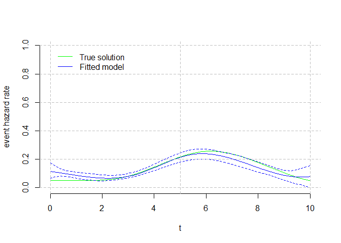

<!-- README.md is generated from README.Rmd. Please edit that file -->

# SplineHazardRegression

<!-- badges: start -->
<!-- badges: end -->

There is no R software available for the direct estimation of hazards
with uncertainty estimation (confidence intervals).

The primary goal of SplineHazardRegression is to make available the
methods for flexible estimation of hazards using (cubic) b-splines
published in Philip S. Rosenberg. “Hazard Function Estimation Using
B-Splines” In Biometrics, Vol. 51, No. 3 (Sep., 1995), pp. 874-887
<https://doi.org/10.2307/2532989> The input data is time-to-event data
(e.g. time to death), possibly right-censored and with late entries
(both meaning that patients are followed-up for unequal times).

The package also allows the flexible estimation of the cumulative hazard
and cumulative survival functions, as well as the compuatation of
aggregate measures for those (average, median, interquartile range,
etc).

Different methods for the automatic selection of knots and for variance
estimation are implemented.

## Installation

You can install the development version of SplineHazardRegression from
[GitHub](https://github.com/) with:

``` r
# install.packages("devtools")
devtools::install_github("fespuny/SplineHazardRegression")
```

## Example

This is a basic example which shows you how to simulate time-to-event
data and fit a hazard function, deriving then cumulative hazard and
survival estimates.

### Data Simulation

``` r
library(SplineHazardRegression)
## simulation parameters
   knots = c(0, 1, 3, 6, 10, NA, NA)
   betac = 1 * c(0.05, 0.05, 0.05, 0.05, 0.40, 0.1, 0.05)
   HParm = data.frame(knots, betac) # 'A Simple B-Spline'
   cll = c(0, 5)
   cup = c(5, 10)
   cih = c(0.0125, 0.025)
   CParm = data.frame(cll, cup, cih) # 'Light Censoring'
## calculate simulation true hazard and censoring distributions
   INPUTS = etsim_inputs( HParam=HParm, CParam=CParm, SampleSize = 301 )
## simulate time-to-event data using true distribution
   SimDat = etsim(INPUTS)
## histogram of the fully observed hazard data (gray) and censored observations (light blue)
hist( SimDat$time[ which(SimDat$status==1)], main="", xlab="t", breaks="Freedman-Diaconis", xlim=c(0,10) )
hist( SimDat$time[ which(SimDat$status==0)], main="", xlab="t", breaks="Freedman-Diaconis", xlim=c(0,10),add=TRUE, col=rgb(173,216,230,max=255,alpha=100) )
```


### Hazard regression

``` r
## Fit a cubic B-spline regression model using the true knots
   # yd0= read.csv("C:/local/CORU/Survival Hazard and KM/Philip Rosenberg papers and code/matlab v1 PR/Dataset1.csv", header = F, col.names = c("time","status") )
   # SimDat = yd0
   timeout = seq( 0, 10, length.out = 101 )
   # Result = hspcore(yd=SimDat, ORDER=4, knots=c(0,1,3,6,10), time=timeout, Bootstrap = 120, verbose=FALSE )   
   Result = hspcore(yd=SimDat, ORDER=4, Exterior.knots = c(0,10), Interior.knots=NULL, SelectBestKnots = TRUE, time=timeout, Bootstrap = 120, verbose=FALSE )   
#> [1] "Automatic search for K the number of interior knots of the B-spline hazard function"
#> [1] "K= 1 AICc=1255.71234583241 knots= 0 5.3 10"
#> [1] "K= 2 AICc=1256.96166040556 knots= 0 4.1 6.2 10"
#> [1] "K= 3 AICc=1255.09947086603 knots= 0 3.1 5.3 6.8 10"
#> [1] "K= 4 AICc=1256.53512461985 knots= 0 2.9 4.4 5.8 7.1 10"
#> [1] "K= 5 AICc=1258.59320906731 knots= 0 2.7 4.1 5.3 6.2 7.3 10"
#> [1] "K= 6 AICc=1259.11099991895 knots= 0 2.4 3.4 4.8 5.6 6.4 7.4 10"
#> [1] "K= 7 AICc=1261.44425813819 knots= 0 2.1 3.1 4.2 5.3 5.9 6.8 7.6 10"
#> [1] "K= 8 AICc=1260.69325110873 knots= 0 2.1 3 4.1 4.9 5.5 6.2 7 7.7 10"
#> [1] "We use 3 interior B-spline knots"
#> [1] "K= 3 DOF= 7 knots= 0 3.1 5.3 6.8 10"
#> [1] "alpha0= 0.114459422525731, 0.114459422525731, 0.114459422525731, 0.114459422525731, 0.114459422525731, 0.114459422525731, 0.114459422525731"
#> [1] "Variance estimation using bootstrap"
#>  [1] 171 125 177 183  77 293  88  81  49 106 240 295 246  10 297 253  48  12  99
#> [20]  36 237 288 102 248 141 270 291 257 157 202 300 128 235 286 296 268  60  91
#> [39]  82 284 219 181 242   4  85 150  56  31  37 130 189  16 251 218 122  43  14
#> [58] 162 187 223 259  23 120  29  94 118 277 154 274 135 199 276 184 179  68  90
#> [77] 289 159  54  71 227 193
#>  [1] 256 162  35 267  27  16 164   3  68  28 221 176   8 240 116 166 144  53   4
#> [20]  40  44 100  70 289 227 134 239  24 294  80 124  91 122 161   6 112 279 167
#> [39] 218 106 147 214 210  51 260 255  69 205 114  31 243 247  26   1 181  63 135
#> [58] 108 263 262  18 199 219 258  88 183 222 115  89 170  54  43  67 254  39  58
#> [77] 234  23  83 126 235  22 223  76 204 132 142 121 119 173
#>  [1] 182 185 106 219 167   6 232  76  86   9 216  69  62 178  45  25 179  28 193
#> [20]  74 259  78  22 212 120 190 137  61 188  83  67 260  32 159 251 142 160 196
#> [39] 107 202  29 287 227 262 250 206 282  96  10  97 183 244 127  26 289 115 184
#> [58]  84 154  87 121  51  16 208 135  85 210 200 205 281 169 199 170 207 274  18
#> [77] 288  90 249
#>  [1] 141  60 241 293 179 171  37 291 233 158  18 250 150 177  36   9  92 273 252
#> [20] 101 117 209 239  32 245 258  62  93 220 153  23 261 281  48  94 271  84 214
#> [39]  75  68 132 135 246 152 100 234 110 203 118 224 216   8 248 168 251 202 186
#> [58]  72  13 269 190 160  74 284 225 162  47 161  41 178 127 235 109 134 116 205
#> [77]  21   1  64 287 194 123 120 174  49 140  78 204 255
#>  [1] 218  80 256  91 281  60  70 136  81  23 100  10 148 206  48  84 260 221  88
#> [20] 126  45  34 147 112 191 226 238 276 212 102  25 183 118  63 266  58 159  99
#> [39] 133  49 134  55 158 200 228 128 139 240 106 164 250  77 279 162 169   4 167
#> [58] 154 216  46  36 209 277  79 278 225 155  53 113  94 258  78 268 289 176 121
#> [77]  31 103  18 198 152 264 123  47 124  76 257 143
#>  [1]   5 180 187 282  20   6 239 136 209  43  13 161 234 191  31  85  92 130 116
#> [20] 273 124 164 139   2 205 243 178   4 224 246 105  90  53  40 121  88 216  17
#> [39] 146  24 294 173 231 134 218  38 114 245 208 123 115 196 138  12  36 276  69
#> [58]  55 286 155 120 263 172  81 221 147  98 148 290 128 275  65   1  35 300 182
#> [77]  78 206 104 258 203 265 153 133
#>  [1] 292 150  49  99  82  43 143 273 171 122 199  75  53 194  60 167 106 235  89
#> [20] 177  39 291 157 155  33 244   6 259 183 154  55 232 114 257 107 297 271  68
#> [39] 224 230  72 255 215 246 111  42  85 184  10   3 161 288 214 201  97 237 124
#> [58] 158 137  76 168 162 172 191 148 262 264 221 231  98  84  94 197 108 129 263
#> [77]  57 296 241 228  16  27 178  30  67
#>  [1] 180 162 132  49 283 232  94 289 144 124  30 120 210 254  34  47 237  21  65
#> [20] 109  96 134 222 248 250  69  83  31  13 161 148 214  97 279 262   7  68 181
#> [39] 208 201  91 245 229 242 217  77   8 170 185  74 287  25 192 244 255 266 139
#> [58]   5 209 280 294 106 168 143 136  39  67  37 286  45  26 258  16  57 156  43
#> [77]  92 218 155 256
#>  [1] 225 168 175 132 213  50 187 290 195  41 184  58  56  15 215  81  48 224 185
#> [20] 265 141 243 214  96 293 211 140 148 179  16 208 160 170 156 145  67 294 207
#> [39] 228 138 103 111  47  33 255  51 114  18  23 125 105 254 171  95 282 292 226
#> [58] 244  79 143  63  92  36   7  71 264  53 240 300 221 144 100 267 189 166  14
#> [77] 257 127 201 154  94 235  57 218 237 151 124
#>  [1]  19 292 105 111 147 298  86 287 278  58  90  68  71  30 276 256 157 163 265
#> [20] 202  59 288 253  57 130  20  28 199 273 192 239 104  46 167 190 281  92   1
#> [39]  47 164  22 172 178 145  34 109 250 266 141 240 213   5 221 242 118 259 142
#> [58] 148 212 114 123 103 294 254 258 161 245 159 225 166 211  45  50   6 267  40
#> [77] 120 200 208  73  12 262 125  96   2 182 185 160
#>  [1]  86  53 103  11 209 292 214 245   6 181 132  74  10 201 229  72 107 266 212
#> [20]   1 230 288 275  47  88 125  77 124 148 157 278 109  18 127  33 144  41 202
#> [39] 221 243 138 193  99 222 227 195 282 258 192 100 231 180 164  55 199 247  32
#> [58] 300  15 267 297 169 188 149  54 276  91 187 273 207  59 183  78 173 155 234
#> [77]  34 241 298 198 259
#>  [1] 295  71 281 116 219 180  63  99 121 170 190 117 194 257 228 188  73 212 107
#> [20] 215  16  13  37 270 237 143   7 288 301 184 153 145 263  93  56 111   3 297
#> [39]  81 258 235  25 100 267  60 284 141  76 245 280  22 154  21  19 172 300 169
#> [58] 250 269 135 187 238 130 262  94 149 285 246 230 275 191 146 113 164  89  77
#> [77]  40  10 186   5 193 114 159 171 108 140 294
#>  [1] 201  31 298 213  53  99 240 256 151 170 200 246  44 153  69 266 155 117 196
#> [20] 179 185 182 206 194 175 203 120 128  67  39 295   2 281 197  96  98 268 291
#> [39]  71  55 260 188 288 227 186 136 222 106 237 294   4 125   1 217  83 253  49
#> [58]  76 276  10 301 279 207 221  80 114 254 272  36 286 146 181 180 230  50 263
#> [77] 166 139 132 208 220 212 280 241  68
#>  [1]  15 265 232 130  79 183 175  85   4 186 218 270  84 294 301 245 100  24  34
#> [20] 182 300 101 174 156 269  40 172  10 248 253 228  91  95  99 144 299  93 114
#> [39] 134  77  13 287 151 122  87 289  42 203 173 277 275 105  17 132 184 264  53
#> [58] 194  94  83 118  32 247  56  11 220 249  45 236 181 187  69  37 165  18 121
#> [77] 263 155 211 131  73 234 280 202 161 117 244 271 209 257 215
#>  [1]  91   6 294 247 299 300  48 215 152  15 272 236 199  88 218 187 104 241 182
#> [20] 297   1 223 230  41 234 106 107 136 258 144 173 201  33 168 110 192   4 194
#> [39] 285 289  92 167 209 169 119  49 239 205  39  97 191   7 125  70  78  77 171
#> [58]  36  66  81 129   8 147 130  44  90 150 301  68 212 177  29  64 278  93 186
#> [77] 288 287  22 103   3  83 254 139  98 296
#>  [1] 253 147 259  37 122  80 297 129  13 134  56  25 182 236 186 100 257 166 126
#> [20]  91 284  85 274  10 185 170  66  82 130 228  38 167 220  78 211  47 230  99
#> [39] 268 227 189  57   5 105 222 112 249 183 132 137  88  28 103   9 291  20 150
#> [58] 286 214 294 178 117  52 267 242  48 206 194 224  92  90 295 153 237 146  49
#> [77] 246 301 299 175 188  27   4  29
#>  [1] 255  45  91 249  23 123 247  27  79 159  99 165 154 101  60 208 275 269  69
#> [20] 185 147 141 273  89 100 265 264 288 204  62  82  95  35 258  21 126  49 119
#> [39]   4 143 239 124  75 120 136 261  67 292 158 142 178 283  41  52 287 285  84
#> [58] 252 161 198 216  68 135  72 121   9 277 144 248 194   5 241  28 138  90 206
#> [77] 117 131 301  64 133  85 210  43  61 224 173 163  83
#>  [1] 154 159  40  84  70 180  28 110 243 256  18 153 220 260 214 114 262  91 281
#> [20]  92 245 277 249 138  17  97  21 272   2  86  46 231  11 183  34  13 182 174
#> [39] 268 147 126 276 124 101 299 173  24  41  62 235  52  56  39   4  75 269 242
#> [58] 163 145 102 293 295 117 184 116  15 132 257   1 233   6 169 253 216  73  95
#> [77]  71 202 108 181  20 165 120  36  94  82 166   5  38
#>  [1] 291  48 271 300 214  94  62 144 240 155 135 150  67  36  53 161 126 212  91
#> [20] 278  59 201 274 263 239 296  56  38 224 166  80   1 265 194 211 142 237 160
#> [39]  17 210 131   7  24 253  99 226 258   3 236  31 181 266 218 284 164  34 162
#> [58] 179 297 140 115  95 251 241 209   2  74 100 202  71  26  73 151 105 156  63
#> [77]  41 178 167  60  33 180 184  68  92
#>  [1] 269  57 277 270 198 111  70  86 235 244  64 227  12 172 241 294 274 155 119
#> [20]  69 171 243 158 152 112 134 279 239 273 187  50 257 255 167 109  99  72 165
#> [39] 246  47 107 203  40  45  95 117 216 121  75  13 191 163  26   6 208  27  74
#> [58]  63  61 220 149 164  35 224 108 278 293 301  90  34 156 200   5 179 248 139
#> [77] 209 247 265 285 213 240  23
#>  [1] 256  52  69 109 245 233 101  54 288  33 234  18 100  66 212 193 117  73 187
#> [20] 215 241 220  47 239 250 154  26 149 267 195 218 191 172 260 102 182 188 120
#> [39]  12 208  75  20  21  71 261  41  16 171 142 170  42 105 167  22 211 231 216
#> [58]  89  34 223 156 199 238 196  80 197 292 168  32 166  53 179  61 246  90  10
#> [77] 115 270 139 254 253  92 300  28  48 190 229  87 158 122
#>  [1] 148 124 158 250 188  20 111  46 185 166  37 265 213  28 209  18 152 280 239
#> [20] 138 125  14  98 174 195 214 231 258  64 136 261 153 287 169 279 192  40 205
#> [39] 113 145  99  73 167 163  69 184  81  53 159 217 132 223 224  35  57 210 180
#> [58]  39  51  91 247 114 193 275 106 266 170 230   3  67 123 143 142  83  26 190
#> [77] 207 164   8 281 129 289 211  65 249  85 141 293  76
#>  [1] 137 276 200 277  14 244  75 158  47 246  90 224 185  78 110 175 197  26  96
#> [20] 205 285  85 146 103  51 267 102 189 114 296  59  50 168 295  62 173  70 229
#> [39]  95 300  33 297 142 122  44 284 176  20 247 198  21 231 184  68  32 207  77
#> [58] 127 123 109  42  28 238  24  53 153 268  71  74 250 138 160 124 261  80 187
#> [77]  93 210   1 265 112  39  52
#>  [1] 132 243  59  49 296 226  74 250 133  93  45  56 195 277 222 244 115 113 273
#> [20]  67 247  25 125 280 187  95  73 256   6 276  26 166 106  46 253 102 236 112
#> [39]  90  61 124 151 122 227 237   8 212 272 293 268  64 185 143 217 159 239  68
#> [58] 189 233  81 285 165 267  16 218 138 216 252 263  19 301  82   1 254 130  52
#> [77] 184 140  97 207  98 139 190  10 225 283
#>  [1] 119 229 127 108 261 167 278 190  39 255 136 202 258 233 266  69 230 171 104
#> [20]  79 212  27 277  33 186  23  47 197 296 260  34 235 146  55 126 201 222  80
#> [39] 239 173 217 142  13  52  95  59 180  62 269 203 215  32 231  61 301  90 162
#> [58] 121  98 253 135 181  45 191  22 130 256 246 145 271 289 263 100 225  83 150
#> [77]  99 218 292 249 248 267  81 285 283  91 105 300 226
#>  [1] 269  41 300 156  29 298 130 191  73 125 170 162 289 211 260 140   1 174 258
#> [20] 265  47 290 243  93 218 166 280 158  78 124 274 229 135  94  39 129  63 171
#> [39] 123  86 278  52 106 163 296 217 137  57 276 198 154 142  87  18   7 230 242
#> [58] 285  24 246  19 235 145 188 275  64  80  12 165  88 148 212 273 190 236 119
#> [77] 115  44 291 264 282  60 187 167  21 256  45  84 271  65 184
#>  [1] 114  16  77  85  36  17 210  10 137 253 164 286  67 172 281   4 209 237 117
#> [20] 219  39 234 228 195 224 277  61  26 134  87 251 271 287 182 105  30 298 130
#> [39] 127 111 193 296 139 135 203 115 267 161 249 248 213 101 279 294  35  53  76
#> [58]  63   7  13 226 216 174 151  80 220 160 229 158   5 299 250 270 108 107   1
#> [77] 110  90 257  99  68  24  19 261
#>  [1]  93  65 168 190 285  90 263 281  39 249  85 219  43 141 260 272  36 279 301
#> [20] 181  24  88 248  12 130 120 170 257 206 152  52  75  58 296  98 179  99  97
#> [39] 229  51 234 271  16 163 177  71   2  61 173 276 225 123 300 126  22  94  68
#> [58]  60  76 288 210  38 156  18   9 216  55  57  87  40 277 212 262 184 112  20
#> [77] 215  28 188  45 261 295  42 245  19 194  34  91
#>  [1] 107  69  41 131 227  71 129  96 214  26  91 232 252  57 125  66  75  29 101
#> [20] 269 220 177  12 114 222  50  32 140 271  89  44 256   4 286  78 185  82 179
#> [39] 207 155 137  27 104   8 258 194 237 243 150 293 296 273  80  47 132 183  23
#> [58] 126 154  76 170  51 267  83 191 287  14 294 206 255  88 275  46 198  33 238
#> [77]  77  99  86 163 245 203 274  97 149 108
#>  [1]   8   4 154 292 104 134  40   5  91  57  55 162 119 272 131 254 234 149 105
#> [20] 225 153  25  28 130 106 239 147  87 171 129  18 160 170 262  99 285 232 267
#> [39] 120 249  78  76 143  17 139 142 263 241 286 113  77 238  90 293 242  46 294
#> [58] 176 146  24  27 215  63  71  56 167 136 275 255 178 300 145 169 218 102 137
#> [77]  22 185  97 250 219 189 199 150 200 265 111
#>  [1] 150 224  58  93 203 211 238  79 268  87 126 156 100  28 227 128 214  84 202
#> [20]  47 201 243  13 122 145 266 135 131 289 187 113   6  66 117 273 160 217 253
#> [39] 186 258 196 287  19  48 275 193  52 173  20 265 270 180  17  34 256 174  86
#> [58]  16 246 249  61  39  46  29 146 184 241 177 163 195  81 105 264 221  73  95
#> [77] 166 204  56 140 129   4 259 299 274 178 294
#>  [1]  16 151  56 267  70 185 117 167 210 200 102 186 153 206  78  86 189 215 166
#> [20]  81 184 196 105 298  71 168 223 158  60 183 227 156 232  88 203  63 244  76
#> [39] 141 233 152 282  27 276 250  84 228 299  45  29 269 247  51 140  64 119 278
#> [58]  23 129  37 220 157  24 242 205 107 131 266  96   6  41 188  30 101  33 175
#> [77] 226 134  58 178 124 100 249 229  46  93 181
#>  [1]  91 236 119  25 106 117  17 183 199  92 249  16 135  48 164 251 107  12 196
#> [20]  95  57 157 166 105 284 220 189  69  90 161  86 247 201 155 115 103 224 212
#> [39] 272 262 191  42 291 231  98 216 110 136 252 168 281 130 111 238 292 195 267
#> [58] 174 187 126 208 264 255 148 150  62 299 288  60 144  47  85  61 203 219  35
#> [77] 256 294 146 120 290 218  27 301
#>  [1]  11 146 208 196 158  29  40 138 173  68 272 218   6  21  10 171 130  99 300
#> [20] 299 210 118  94 258 122  82 287 221 198 105   5  85 203 293 291 157  92 269
#> [39] 100  49 144 101 284 194 209 151 254 278 261  30 282 271  43 193 220 129 154
#> [58] 169 223  22 290  28 168  12 116 124 195 263  72 244 149 222 251 242 142 289
#> [77] 108 113 140 166  93  36  67  89  62  59
#>  [1] 204 225  87  11 231  36 100 170 125  22 260 293  13 182  60 167 288 121   3
#> [20] 224 263 262  93  75 297  88 208  73 166 239 151 270 114 273  58 213 150 294
#> [39] 233  67 254  32  17 215  85  41 131  78  24 184  69 115 113 191  94 272 102
#> [58] 189 295  25 175  51 176 202 142 194 267  81 290  40   9 160 238  71 118 253
#> [77] 107 110 168 227  30 252  44
#>  [1] 291 113  86 181 238  92 136  41  85 148 244 178 166  74 102 300   6 168  57
#> [20]  59  22  58  63  75 292 205 250 242 219  77   1 222  18 253 206   3 283  40
#> [39] 273 249 252 151 267 262   7 170 256 104  81 180 269 230 118 301  98 208 263
#> [58]  71 276 106  46 140 174 177 259 164 266  95   8 245  53 287 240 211 183 161
#> [77] 194 179 105  25  38 157 255
#>  [1] 277 129  84  28 228  88 174 180 191 158 257 272 291 171 264 153 168 221 273
#> [20]  65  20   1 142 164 250  89  52 134 230 208 187  98 188 263  92 286   4  82
#> [39] 210 111  59  62 118 101 144 301 114 192 282  77  39  66  96  23 121 253 122
#> [58] 119 215   2   3 186 239 218 246 212  16 184 243 279 185  24 107 104 300 297
#> [77] 155  47 249 189 178 182 173
#>  [1] 285 169 215  32 288  19  98  77 122 268 130 211 110  71  61 187  57  42 297
#> [20]  47 222 234 181 112 137 262 171  23 100 300 296 244  27 176 232 184 254 140
#> [39] 281 149  26 229 223 224 107 153 198 292   5  58 283 126  84  10  22  74  18
#> [58] 282 105  63  93   9  55 174 209 235 298  41   7  59  85 258 103  38 195   6
#> [77] 162 132 142 249 225  80 264  53
#>  [1] 144 110  93 163 212 245 257 205  60  64   4 231 196 103 130 102 203 207  57
#> [20] 161 256 158  28  56  72 224 236 169  65 156 137  12 100 151  83 267 138 192
#> [39] 284 150  26 178 146 117 127 269 116 183  91 155 140 225 208 141 190 160 109
#> [58] 266 279  38  78  25 229  80   8  33 214 105 111  21 199 118 119 291  53 232
#> [77] 195  59 233 171 234
#>  [1] 258 195 254  10 252 215 154 144 119 150 159 244  59  33 236 260 101 264 196
#> [20] 224  67  84 209 134 222 248 249  99 163 162 230  26 115 210  16 235 269 106
#> [39] 140 132 220  57 234  92 157 301  12 228  97 117 286 268  75   6  66  95  85
#> [58]  96 186 184 240 118  81 296 199 185 173 211 216 189 145  77 232  76 272  83
#> [77] 278 213  46 271 130  60  43  56
#>  [1] 178  19 200 128  86  57 140  48  79 274  66  23  85 101 144 221 139  33 251
#> [20] 204 196  83 185 255 164  70 110 148 284   2  72 244 175  93 214 121 181 281
#> [39]  58 286 136  15 205  51 151 137  13 213 172  69  64 112 270  47  80 264 280
#> [58]  81 138 269 202 171  45 123 241  46 226 222 228 159  42 273 174 197 232  24
#> [77] 299 295 207  65  14 106 146  34 238 285 278 215
#>  [1]  11 208 111 177 259 127  75  42  17 267 130 199  90 235 114 295   8  33  67
#> [20]  36 192 173 139 196 278 166 105 284 301 212  45 148 171 215 249 256  63  29
#> [39]  32 165 104 169 189  66 106 279 103 162 132 283  95 153 262  46 290 144 240
#> [58] 179 245 218 176 244  18 223 187 110  89   9   5 125 147  39 101 181 143  59
#> [77] 265 227  94
#>  [1]  29  55  31   9 142  69 169  41  42 161  20  19  68 214 216 139 227 107  84
#> [20]  23 162 151 178 116 114  95  99 253 229 130 212 276 301 209  49 196 115 121
#> [39] 199  91  72 232 205 257  14 281 127 285 197 245  94 134 128 297 284 138 191
#> [58] 280 264 279 292  67 153  90 273 242  40 152 181  88  33  79 243  93  25 299
#> [77] 275 111 198  74  64 270 187 148 133 120
#>  [1]  54 179 226 100  92  97 108 194 167  66 101  36   1 102  86 268 107 253 278
#> [20]  51 116  27 288  94 209  74 259 112 157  84   2  41 279  64 187 132 292 144
#> [39]  82  26 216 223 242 270 286  34   3 221  80  87 192  76 158  14 239 195 261
#> [58] 122 238 191  78 170 176  49 232 181 186 241 200 196  18 246 134 163 110  58
#> [77] 161 222  88  56  10  47  13 118 214 210
#>  [1]  23  50 252  83 100 116  43  20 101  28  86  95 200  24  67 232 172 268 274
#> [20] 111 157 235 115 156 154 135  17 176 146  73 272 249  10 211 285  85  94 198
#> [39]  22 230  39 300  26 284  82 223 117   9 212 151 263  54  41 110 114 141 224
#> [58] 290 261 197 102 203  12 231  87 219 282  64  14 228 125 163 119 258 241 297
#> [77]  71 167  29 139 159 186 148  61 105  49  91
#>  [1]  51 241 217 277 257 294  16 240  37  86 226 164 298 175 112 244 102 253 285
#> [20]  55 186 282  98 238  84 124  18  29 231  71   7 173 162 121 192 215 171 104
#> [39]   3  68  42 158  57 101 301  39 123  33  12 168 214 199 208 190 269  36  23
#> [58]  14 288  85 117 182 266 258  89  53 222 203  26  67 170  93   4 242 150  49
#> [77] 109 279 250 188 160  99 245  47 276
#>  [1]  23 290 153  89  99 236 119 216 223   1  32 280 191 110 282 254 189 298 243
#> [20] 204 237 154 185 229 255 102  83 244  65 285 262  40 143 186 269 192  60  50
#> [39]  42 160 231 182 228 130 292 279 150  67 265  87  26 257  52  93 299  62 188
#> [58]  25 218  53   4  10  36 172 264 190 131 177 124  17  14 174 148 168  37 149
#> [77] 187  43
#>  [1] 238 112 134  68 291 133 296   2 215 252 190 268 301 209 141 136 280 218 126
#> [20] 132 300  13  95 108  42 281 130  33 131  32 160 171 289 248 181 293 288  21
#> [39] 275 270  24 232  57 103 297  71 283 256   9  49 118 273 197 204 125  93  79
#> [58] 294 244  11 105 137 255  62 243  44 257 286 129 148 276 175  53 269  77  67
#> [77] 287 139 163  92 210  40 199 170 165 149 109  99
#>  [1]  46  64  93 110 186 279 295 225   9 204  48 210   7  21  86 212 271 283 131
#> [20] 190 213  10 232 230 260  17 165  94 104 296 207 205 123 262 130  88 248 237
#> [39] 268  81  26  80 177 151 274  67 133 193 244 254 290 201 196 181 239 105  22
#> [58] 289  20 111 166 229 137  69 173  58  51   6 132 134  55  39 219  99 224 113
#> [77]  12 234 286 272 280 119 228 297 118  61
#>  [1] 121 212 282 110 154 107 158  76  17 188  70 176  27  58 235 246  40  75  15
#> [20] 124 169 275 218  35  32 222 300  31 207 285 259 243   2  62 260 249 166 149
#> [39] 138 295  39 146  45 109 181 289 237 254  82  23 187 104  29  86 257 296   5
#> [58] 273 185 213 244 233  48 143 223 175  64 256  11 292 113  65  99 129  19 247
#> [77]  51 228  42  79 261 192  46  36
#>  [1]  47 182 178 210  65 114 107 279 169  70  59 271  32  24 128 137  51 183 225
#> [20]  86 268  12 146 139 227 260 270  72 253 241 174 190  31 106  52 283 173 194
#> [39]  53 282 151 149  14 135 144  64  39 117 200 222   5 110 223  75 129 131  83
#> [58] 191  87   7 286 245  79  66 204 296 244  42   4 299 158  91 189  88 160  22
#> [77] 101 228 172  11
#>  [1] 137 145  42 213  69 116 245  39   9 235 185   5 167 181  95  43 104 255 132
#> [20]  25 188 256   4  31  79 143  54 190  64 275 107 282 193 284 112  45 246 242
#> [39] 201 106 154 267 183 108  78  87  44 124 114  41 259  76 215  30  74 239   6
#> [58] 229  14 276 226 157 222 148 182 209 120 138 231 234 109 162 298  18 296 202
#> [77] 200 121 142  68 115 221 230 159  53  60 204 140 294
#>  [1] 203 220 242 164 289 273 120 129 263 277 163  58 116 156  84 186 208  57 272
#> [20] 107 270   6 254 197 252 173 278  37   2  12  21 230 133  42 232 222 122 250
#> [39] 213 126 101 227  28 271 300  88 185  74 111 161  87 183 207 298   4 255 204
#> [58] 106  81 240 192  98 138 115 205   7 160 157 199  19 141 260 241 297  96  66
#> [77]  46 110 148 153 121  10  73 151 234 139  95 244 162
#>  [1] 276 257 237  67  68 231  61 264  48 185  33 213 289   5 137 123 171  17  69
#> [20]  80 215 261  46 167 133 110 296  63 297 250  84  36 164 226 239 159  49 258
#> [39] 138 280 202 135  34 128  15  78 284 217 117  18  77  65 136 183 259 145 240
#> [58] 292  12 247 105  82 225 179   8 191  99 232 207 169  62  54  43 187 230 184
#> [77] 131 210  35 173  93  92  95 299
#>  [1] 194 272 103 299 143 250  85 232 164  77  28 130 141 261 296 209  12 219 270
#> [20]  36  38 111  19 246 119   1 140 107 110 234  31 165  81 199 171 121   2 154
#> [39]  53  72  17 109 100 228 244  39  98  20 185 120  69 135  80  56 148  63 233
#> [58] 158 118 192  10 271  60  23 231 188 187 254 181 162  79 258 208 212 147  45
#> [77] 222 275 116 214 226
#>  [1] 124 278 173 122 290 296 127 200 229  49  57 255 195 231 178 109  22 243 234
#> [20] 271 273 217  31 238 102  12  44 166  86 239 269  56 118  91 132  81 126 284
#> [39] 241  32 187 297 208 259  63  64 276 156 143 114 282  27   2 205 265 183 161
#> [58] 165 153 162 286  26 230 199  45 190  54 148   4 258  79 260  47 149 170 112
#> [77]  77 151 224 150  92   3  98  10
#>  [1]  79 261 266 197 110 126 113 242 208 202 155 181 169 236  33 295 191  84  32
#> [20]  91 150 268 262 146 245  64 243 167 198 108  47 254 285 148 118  51 115  11
#> [39] 297   9  67 276  94   4 124   1 195 233 122 226  62 111  76  83 141  53 299
#> [58]  39  38  17 267   7 136 140 112  20 272  10 174 159 203 259 125 212 143 185
#> [77] 144  86 258 301 154 201  23  58 251  95
#>  [1]  86 260 215  96 110 287 175 295  21 154 214  46 194 152 265 177 289 254 197
#> [20]  45 275 109 132 229 236  59 139  28 200 150 268 237  25 118 157 134  20 183
#> [39]  15 137 232  97 244 301 168 125  57 218 298  84 162 250  48 140  69  82 100
#> [58]  83  68 147 283  87 224 277 195 249 114 286  81 262 106  62   6 290 107 252
#> [77] 270   8 292 239  29   1 274 172  98  22
#>  [1]  83   5 234 254  37 108 291 163  38  90 207 245 130  86 107   8  95 287 240
#> [20]  87 200 205 293 252 148 248 120 113 110  97 171 128  64  93 164 149 173  33
#> [39] 246  51 116  18 143 236 268 170 167 263 286 150 289  42  16 122 279  58 166
#> [58] 155  92 235 232 161  78 253  81 145 100 251 193  69 111  70   1  85 104  55
#> [77] 264  62  84  59 202 231
#>  [1] 206 169 224 288 159 140  43 265 162  80 269 272 216  39 278 234 250  78 227
#> [20] 246  76 212 123 198 208  12  28  74 179   8 177 168 261 158 105  45 150 197
#> [39] 247 145 127  44  52  26  38 118 201 113 175  73  68  64 173  47 293 254 165
#> [58] 214 215 120   9  57  59 102 210  90 164  49 178 289  51  20  48  29 240 160
#> [77] 136 217  18  65 268  84 144  27 109 222
#>  [1] 188 134 268 101  68 254  61  70 115 249 150  81 193 198 187  38  30  99 290
#> [20]   8 106 220 298 118 247 246  12  16 205 146  40 200  87 170  19 213 165  31
#> [39] 243 124 269 211   2  49 122  43  56 274  15   1  59 231 113 196 151 259 276
#> [58]  34 177 281 138 131 185 132  97 167 171 157 153 270  72  75  88 143 207 210
#> [77] 293  69 180 128 284  18 288 135 189 297
#>  [1] 213 120 134 188  35 206 244  99 182 116 131 178  13  97 233 166 184 216 167
#> [20]  36 285 219  41  95  83 238  96 144 252 267 287  63 114  60 243 115 130 169
#> [39]  16 261  23  56 226 159  69  89  43 137 290   5 220 104  57 280 153  53  55
#> [58] 229 268  51  87  75 125  66  11 210 194 300 160 111 236 239 282  24  91 203
#> [77]  47 100 241 224 163 237  68 140 133 257
#>  [1]  87 239 230 258 162 153 229 123 125  13  53 181 176 285 195 241 175 199  28
#> [20] 110 180 284 243 262  21 255  96  15 172 235 288  63 135 264 245  20 212 132
#> [39] 106  17 116  75 141 274 152 187 156 150 247 122  92 137 118 189  74 224 283
#> [58] 225  29 234 300 290 134  12 184 240 259  39 119 299 161 109 204 167 170 280
#> [77]  78   2  45 295 114 232  61 242  65
#>  [1]   2 151 143  69 131  23 168 242 293  10 216   7  62 187 109 170 226 188 117
#> [20]  30 167 116 206 256 264 283  95  91 258  56 113 273  64 292  51 200 291  14
#> [39]  70 120 179  46 125   6  42 221 269 169 212  74  48 246  83 144  77 247   9
#> [58]  21 105 266 229  61 178 265  66  80 182  25  53 294  37   4 191  98 213 297
#> [77] 100  22 180 219 282  15 289 225 262 267 148 263
#>  [1]  49 216 167   3 220 250 258  26 259 298 185 289 164 286 266  69 256 231 270
#> [20] 175 211 221  15 243 267 192  72  55 122  30  24  46 152  52  86 291 161 170
#> [39] 223 249 134 230 102 264 296 300  35 268 294  95  99 191  59  12  89   7 184
#> [58] 261 142 234 146 174 110 120 212 143 128 119  13 209 279 189 232 139 156 165
#> [77]  32  92 150 133  81 235 176 163
#>  [1] 215 174 212 291  90 202  33 184 138 141 242 281 104 157 203 282 123 101  29
#> [20] 226 190  84 177 160 245  81  50 273  56 301 119 236 260 175  47  48  93  74
#> [39] 249 115 198 148 194 102 147 124 127 208 196 100  96 121  66  76  68 151  69
#> [58] 209   8 250   9  51 149 171 213  22  30 293 166  17  70 191  38 153  86 290
#> [77] 210  53 252 258 224 117 228 197  67   7  82
#>  [1]   3 146 210 151  82 150 261 112  17  13 249 218 153  24 265 198  95 244  41
#> [20]  49  25 157 182 248 285 216  93  38 185 241 269 163  50  91 283 203 206 250
#> [39]  61 158 270 155  97  79  31  59  85 179 219 208  53  29 296 273 195  22 225
#> [58] 106 247  66 204 109 131 154 176 126 149 152  40  71  34  94 295 139 253 172
#> [77]  36 173  98 192 115  76
#>  [1] 171 141 147 217 122 113  27  67 219 180 274 249 109 251 228 232 250 187 254
#> [20]  17 200  42 257 164 156 267 295  19 108   2  78  85 160 159 167  47  59 161
#> [39] 136  34 283  50 131  65  40  91  76  86 144  81   5  79 260 172 291  38  75
#> [58] 182 256 155  35 178 213 288 105 206 300 129  93 163 271 241 115 190 239 174
#> [77] 298  66 301 212  31   1 208  58 218
#>  [1]  18  67 244 298 275 293 107  15 139  73 229 137 281 170 251 237  52 141 227
#> [20] 231 246 253   5 268   7 276 105 165  22 258 220   9 287 138  66  45 190 284
#> [39]  85  84 224  53 221 193  25 259 130 202 120 129  42  14 177  59  31 168 103
#> [58] 272 169  80 148 173 185 196 216 210 266 215  76 262 112 200 163 222 146 225
#> [77] 188 282 278  32 135  89 154  58 205 270 235 140 136
#>  [1]  83 264 191 179 181 197 215 164 152 194 297 116 147 219 148 259 178 107   2
#> [20]  79  36 201  29 222 293 230  13 298  21  85 104 266 252  22 231 243 235 123
#> [39]  97 175 111 106 112  14 238 103 255 277 288 127  34  80 160 229 140 154 210
#> [58]  75 227  26  32 258 114 206  20  12 163  46  65 115  96  11 286 183  76 151
#> [77]  95 138 121 198  49 166  19  55 137 301 128 267
#>  [1]  76 243  40  74  10 237  31  68 269  95 263 226 126 113 108   7  92 298  14
#> [20]  85 168 287 162  69 203 256  87 187 159 153 238 260 107 254 274  91 280  29
#> [39] 199  66 161 111 225  33 143  86 148 220  32 128 219 165 251 293 175 239  41
#> [58]  70  94  57  38  80  89 218 270  43 120 207 122 257 259 193 296  55 285 229
#> [77] 267 231 142
#>  [1]  86 294 228 281  64 106  54 109 117  43  42 284 247 128 215 248  76   9  71
#> [20] 201 154 273 133  34 139 257 252 207  70  78 176  39 153  58 230 144 204 136
#> [39] 291 232 278 208 263 179  82  47 229 211 102  77 134  93 270 162  29  41  98
#> [58] 184 113 124 198  49 185 218   4 251 238 112 122 282 100 137  20  91   5  16
#> [77]  27  24  75 191 145 209 193
#>  [1] 214 168 241  19 223 114 219  51 125 155  75  98   9 150 254 224 240 162 163
#> [20] 115 190 261 234 102 279  90 147 135 288 293 137 251 232 148 170 156  94  39
#> [39] 271  45  84  92 200 140 203 103 149 121 213 107 128  68  69 290 178 300 253
#> [58] 126  96 267  67 172  25 249 275 122 291 211  24 197  56 191 157 238 296 185
#> [77] 143 210 138 127 100 188 106 227  54 123
#>  [1]   4  83 198 244 170 250 128  48 123 208  22 261 124 225 160  14  79 201 135
#> [20]  64 293 220  16 185 209  88  92 301 125 158  99 295 107 280 127 176  42 157
#> [39] 236 246  20 191 120 166 197 247  28  23 204 286  62 219 104 112 195  34  86
#> [58]  68 222  25 101  77 182  57 100 277 268  75 248 165  29 130 284  27 228 179
#> [77] 116 249  43 142 115  21 271  32   8 137
#>  [1]   8  74 112  49  41 244  10 246 156 104  36 295 107 266 245 260 247 141  88
#> [20]  80 231  85 222 169 197  27 201 138 254  21 178  67  92 228   4 180 224  52
#> [39] 251 102 108 121 152  98  68  78 262 276 187   3 117 227  75 184 278 281 148
#> [58] 190 269  79  64 198  25  28 159 176 196 149  89 210  77 277 275 202 279   5
#> [77] 272 211  99 268 240  83 220 185  82
#>  [1] 111 237 235 211  55  24  63 160  53  62 119 146 162  39 187 257 159  83 171
#> [20] 294  29 125 243  87 221 190  61  11  91  66 104 292 124 227  12   3 132  47
#> [39] 208 229  77 141 219  96 186 163 253 181 130 273  51   7 105 116  15 283 156
#> [58]  18 276  71 268 286  93 282  35 149  59  19 222 252  30 249  69 291 247 242
#> [77] 244 204 138  21 298 145   5 184 251
#>  [1] 109 208 283  55  67 274 149 220  48 195  88  42 265  73  40 254 129 119 128
#> [20] 259 266  39 290 277 172  57 241 235  21 185 142 244 214 154 236  76 284 243
#> [39] 275  79 192  94 103  36 150 246 182  25 230 162 228 139 184 161 101 227 166
#> [58] 187 218 280   5 248 298   1 234 140   6   9 289 221 169 191 261  96  80 194
#> [77]  70 189 271  30 278  33  82  89 238
#>  [1]  50 139 103 123 268 264  65 241 278 181   5 189 104  37  28 296 229  12  55
#> [20] 293 279  27 142 110  77 224 180  46 230  20  15  25 194 298 193  49  72 113
#> [39] 128 198 287  52 292 170  32  79 182  94  63 217 156 270 248 252 143 138 114
#> [58] 211  85 253  30 131  66 254 150 144  87 202   3  59   8  73  81 301 100  91
#> [77] 225 222 299 235 147 167 258 133
#>  [1] 233 248 301  91 126 247 111 230 192  41  48 278   3  85 284  88  40 259 266
#> [20] 190 194  35 173  51 119 201 131 113 182 231 179 112 249 186  84 221  39 105
#> [39]  50 172 122 245 155 153 294  95 289 103  22  16  52 228 138  87 139  62  82
#> [58] 238  76 258 183 222  78  55 130 216 195  66  31  63 168 275  70 257  30  17
#> [77] 296 224 120 121 208 293
#>  [1]  37  63 101 238 285 175  12  16  68 194 161 197 115 157 201 171 299  44 143
#> [20]  24   2  74  55   6 275 169  31 151 132  54 212 100 147 166 102 126 149 231
#> [39] 269 190  41 119 148  81 233 236  87 241 135 146  59  33  60 178 223 244  66
#> [58] 286  43 240 128 220 133 268 281 186  79 245   1 141  84 265 113  45 155 246
#> [77]  32 217  64 266 137  57  36 116
#>  [1] 232 115 170 174 219 257  83  72 116  22 268 239 297 156 214 112  85 188 264
#> [20] 252 236 191 165 133 259 270 117 106 104  14 107 147 258  15 291 172 130  92
#> [39]  28  26 267 131 294 281 187 154  51  13 249 176  97 155  12  93  53 224 123
#> [58] 185  49 127  59 227 229 288 260 120 136 119  10 135 140 148  27 121 234  44
#> [77]  69 293  23 194 273 233 199  35 254 211  34  38
#>  [1] 140 206 243 265 257 185  50 195 104  30 212 187 269 144 249 258 290 143 182
#> [20] 242  10  26  19  77 299   6 297 270 298  59 282 244   7  29  53 115  94 119
#> [39]  84 172 194 109 266 239  32  42 191  35 216  93  54 139  46  64   2 190 196
#> [58] 227 283 166 192 177 280 125 106 261 164 218  20 123 117 214 174 222 133 251
#> [77] 213 241 285  97 254 163 118 217 160 220 131  13
#>  [1] 280 128 210   6 211 298 202  98 203 156 296  99  35 163 196 244  78 226 130
#> [20] 176  17 109 269 246  30  47 118 300  38  13  31 262  95   4 263  79   3 190
#> [39]  25  19 290 194  68  57 228 254  93 281 301  91  52 168 193  14 174 183 240
#> [58] 217 102 221 158  40 238 268  74 169 242 273 279  84 166 179 253 137  61 198
#> [77] 143 110 111  26  86 236  63  81  43  77 261  20
#>  [1]  26  80  73 245 273 101 141 104 251 150 229 237 114 233  38 254  28 145 165
#> [20]  57  72 278 197 152 250 161  79 220 238 117   9 211 116  81  97 135 235  24
#> [39] 255  68   7 159 128 109 214 146   2  47  63 289 269 164 259 264  27  56  64
#> [58] 206 111 160 171  37 185 148 232  77 194 253  51 218 222 288  10 210  52 143
#> [77] 105 186  15 266  22 162 292 193 166 282
#>  [1] 101 129  45   6  22  37 132   4 198  30 137  51 264 112 203 114 244 226 284
#> [20] 196  17 100 150 111 260 211  50 250  81 144 103 210 283 177 243 217  96 289
#> [39]  65 161 229 233 159 267 280 278 228 120 275  36 252  56 287 254 190  44 240
#> [58] 107  43 167  26  24 182 242  53 201 294  18  72 133  32  89  35  85 221 162
#> [77]  10 202 194  40  54 174  66
#>  [1] 241  20  88 150 130 281 105 301 250 132  15 251 258   2 192 188 183  77  14
#> [20]  71 171 289   5 270 205   9 233  67 265  98 209 228 242 296 274 244  57 260
#> [39]  75 115  56 180  38  22 133 131 128 114  55  92  73 235 272   6   3 102  12
#> [58] 224 214 266 226 234  18  16 177 239  35  66 141 278 182  47 294 238 218 168
#> [77] 123 229  37 215 103  30 282   8
#>  [1] 168 292 280  13 226 133 113 267  16  89 165 286  70 185 262 243  28 125  86
#> [20] 174 277 158  62  19 250 298 200   7 163  30 188 162  83  96  40 224 173 119
#> [39]  41   6   3 124  65 206 167 138   1 102 294  56 245 111  39 289 147 225 189
#> [58]  36  37 275 182 210  48 254 217 142 192 271  91 247 282  38  46 110 105  98
#> [77] 135 154  55  11  54 240 234 209 160  33
#>  [1] 168 155  43  35 130  51 193 255 240  61 178 235  29 224  33  73 120  20 270
#> [20] 253 144 194 177 278 157 195 124  84 244 205  70 210  97   5 263 129 201  28
#> [39]  68 260 220  60  88 156 254  52 131 299 209 286   1 281 198 272 284  75 118
#> [58]  14 248 295 280 127  63 215 175  22 137 135 206 237 132 204 208 252 264 274
#> [77] 102  12  44 231 249  79  87 250  16 257
#>  [1] 147  12  70 229  90 180 245  61 172 218 289 160 129 153 195  91 232 103 168
#> [20] 170 292  89   9 284  85 224 184 193  15 135 241 111 196 220 209  29  82 106
#> [39] 205 211  80  48  67 151 142 192  28 141  78 173  98 139 300   7  13  58 119
#> [58] 244   5   2  49 256 155 214  86 186 127 167 252  84 207 125  42 122 110  65
#> [77]  18 282 227 194 260 157 124 225 250 268 285  26  43 126 295
#>  [1] 159 239 153  28 275 284  50   4 109 177  67  46  69 208 154 226 138  20 118
#> [20]  27 139 113 124 142 167 250 261  54 140  35  13 225 278  36 131 276 132 191
#> [39]  31 233 212 290  14  48 263  80  75 173 245  23  45 108  24 270 170 265 112
#> [58] 161   3  97  88   5 149 227 145 134 281  40  98  77  18 195   1 156  25 266
#> [77] 210  19 171 283 223  87 264 183 214 162  15 222
#>  [1] 246 239 196 125 116 171 156  72  62  97  56 109 121 243 167   6   7 263 285
#> [20]  74  15 292 266 235  16  24  12 195 216  58 179 188 219 211 132 267  40  78
#> [39]  54  60  31 279 262 205  77 298 290 209  25  18 253 222 249  76  30  65 204
#> [58] 146  55  13  42 225 126 165  48 157  39  83 100  80 144  28 164 259 140 141
#> [77]  69 137 238 236  17 131 252 173 245
#>  [1] 163 279  79 289 107  78 181 252 127  91 224 223 253  30 133 172 120 251 152
#> [20]   8  50 139 245 292 264  42 238  40 135  73  16 164 220  47  35  67 246  33
#> [39] 197  88  51 241 219 242  26 239  77 255 155  87 225 254 196  31  74  61 137
#> [58] 294 234  52 288  55  43 215  96 154 291  90 156 118  45 104  44 227 113 114
#> [77]  11 145  10 210 160 250 199 301 193
#>  [1]  80  19 135 285 262 200 258 147 143 235 214  70  25 131  49 291 261 163 115
#> [20]  73 219 195  50 183 178  81  33  43  40 130 257   1 172 157 104 144 149  79
#> [39]  86 160  67 159  14  91 184 243 242  87 140  72 127  75 129  89 126  44  64
#> [58] 117 136  62 142 279 295 208  37 146 138  57 102   2 281 122 179 120   6  55
#> [77] 177 107 282 268 231 145 225 215 236
#>  [1] 148 123 205  39 210  83 287  89  47  33  51 269 223 175 138  36 227  35 229
#> [20]  56 178  32  74 278 233 127 126 174  61   4  73  38 291 111 232   9 107  20
#> [39]  21 172 257 108  72 189  93 280 282  24 139  31  77  71 293 171 204 119  23
#> [58]  48 195  45 219 230 283 128 258 263 136  99 122 132  29 243 244 208 140 147
#> [77] 117  92 220 295  34 222  62 192 253  59 272
#>  [1] 233  88  56  46 124  45 187 118  38  63 119  76  32  24  28  61 237 299  16
#> [20]  83  79  85  25 207 251 268 257 243 199 148 232 278  30  96  41 169  55 256
#> [39]  27 191  29 289 106 158 225 265  15 156  87 189   5  51 240 134 222   2 282
#> [58]  97  84 133  39 266  98 183 224  89  70 259 238 123 141 181  53 182  77 103
#> [77] 128 180 116  66 147 275  74 104 250 236 244
#>  [1]  10 272  76  80 190   1   2  64 178 112  72 253 252  24 124 128  28 270 228
#> [20] 133 165 108 174   4 180 123 251  39   5 146  88  71 152  16 105 187  93  46
#> [39]  69 126  70 284 229  58 238 236  89 297 301 181  82 285 240 141  74 162  13
#> [58] 295 204 278 257 249 154  85 151  25 200  18 103 101  32  27  36   9  94  17
#> [77] 169  52 286 120  57 115 207  99 258  75 136 245
#>  [1]  47   1 201  32  80 298  11 179  24  71 289   8 291  92 280 158 103 195 113
#> [20] 111 235 278  57 136 188 191  53 198  19 296 293  93  81   9  56  58 109 242
#> [39]  77 169 172 128 108  45 107 120  91  35 224  94 254 173 241 204   2 216  28
#> [58] 176 248 272 149 236 141 100 269 249 223 163 180 197 292 217 122  43 178 259
#> [77]   4 288   5  26  65 243 114 134 261
#>  [1] 162 221 248 107 147 228   6 169 233  68  26 245  97  63 297 271 188 101  48
#> [20]  75 227 235 234 119  79 120 229  27 139  52 168  82 154 237 216 163 170  89
#> [39]  78 110  24 261  80 156 175 243 244 125 180 279 259 255  43  70 179  33 232
#> [58] 294 236 165 217 287 278 104   8  49   2 281 295 157   1 269  28  69 199  20
#> [77]  16 265  92 274 201 218 256 273
#>  [1] 229 102 274 225 298 276 233  76 166 119  24 188 140 201  13  99 236 191  89
#> [20] 110 219 227 196 296 275 131  82  49  91 238 139 175 253 280  56   1 221 217
#> [39] 289  47 154 128  42 182 130  39 264 299   9  15 113  17  63  66 248  28 197
#> [58]  40 216 258 145   5 149  92  19 255 122  88 254  68 297  98 234 115  20 293
#> [77]  94  16  77  35 235 272 301  48   6  25 281 116 165  58 226   3  34
#>  [1]  88 110 132 261 273 195 300 228 291 234  86  39 282  43  73 106 100 114  61
#> [20] 229 219 231  67 186  78 210 155 275 281  60 168 119 135 153 149 193  42  83
#> [39] 165 270 177  32 240  75 283 109 216  22 139 272  68  84 301  18 266 126  30
#> [58] 227 108 253 256  58 218 185  34   4 130 244 204  95 284 140  16 213 142 136
#> [77] 151 103 180  64  59 192  25 105  45 118
#>  [1] 183 106 128 149 238  30 289 190  71 175  29 123 222   1 153 200  92 254 182
#> [20] 242  33 295 206  67  70  58 171 243  83 220 216 100 151  93  51 284 278 276
#> [39]  54  61 165 234  65 301  78 155 121  76 248  14  84 213 101 263 260  17 170
#> [58] 297 211 205 172  13  10  34 191 241 189 237 102 239 192 275  89 163  11 288
#> [77] 236 251 259  18 197  94
#>  [1]   4 145 140 255 287 226  72  49  42 252 136 268 150 192 206 197 215 132 238
#> [20] 142  92  67  53 183 177  90  25 130   7  93 210  38  99 199  50 267 168  47
#> [39] 104 225 137 173  75 119 292 223  28 293 244 300  55 242 161  51 102 198 144
#> [58] 230 200  76  37 155 294 106  61 169 263  71 208 284 180 190  18 231 134   8
#> [77]  35 151 247  30  10 146  95 184 125 159 285 251
#>  [1]  76 270 131 175  66  53 216  46  71 235   2 112 280 264 194 266 124 118 169
#> [20]  87 288 208 198  51  93 188 268 273 209 105 104 224  75 155 238 147 150 199
#> [39] 242  60 114 192  35 170  89 293 276 239 196 229 136  94 154  84 205 285  12
#> [58]  92 129 190   3 134 139 212 176 253   6 295  31 133  69 119  58  99  36  41
#> [77] 163  73   7 250  22 156 161 207 282  27 263  14 221   9  96 109  34 281
#>  [1] 231 243 136 282 180  83 113 166 273 187 299 232 177 289  56  31  34 198  50
#> [20] 175 242 122  88 250 213 207 115   6  10  45 121  27   4  20 112  47 211  73
#> [39] 194 154 222 229  67  38  11 168 288 118 114 246 214 208 281  16 108 150 188
#> [58] 255  63 132 110 138 264  19  49  91 170 251 189 219   9 286 258  42 174 153
#> [77] 292 230 101 247 237  74  93 210
#>  [1] 272 110 129 175 158   8 246 168 118 100 277  72 266  30 259  79 132 294   7
#> [20] 151  17 153 299  10 285  38 293  96  41 107  76 204 191 286  92 195 179  83
#> [39]  40  20  62 184  70 188  35  28  75  57  26 166 136 134 203 270  90  29 261
#> [58] 120 237 217 229 271 244 167 219 257 290  63 109 292 298 196  24 233  81 258
#> [77]  44  46 207 114 300 122  51 228 232 224  34 133
#>  [1] 139 199  56 277 144  16 172 164 119 232 206  18  59 222 295 297 200 214 250
#> [20]  25  55 226  52  23 169 286  82  27 276  53 134 182  85 300 184  73 273 155
#> [39]  92 195 260 104 215  41 243 207 263 158  47 191 197 294 271 301 153 179   4
#> [58]  19 148  54 181 269  39 186 161 126  84  13  40  89 108 152 242 245 125 289
#> [77]  97 187 296 267 237 102 210   6
#>  [1]  61 151 170 147 145 217 247  11  46 178  78 268 296 206  22   6 175 137 179
#> [20] 127 128 132 290  84 245 144 280 105  62 283  95 119 120 106 185 112 109 210
#> [39] 266 182 159  31 196 164 293  74 248  10 281 111 216 276  70 110   1  39  91
#> [58] 220 301 165  35 193 209   4  80 229 263  26 189 254 163  38  54 152  67  99
#> [77]  79  71 298 285 172  12 169  29 108
#>  [1]  79 299 241 293 213 135 139 106 101 155 131 301 130 143  82 238 206  96 292
#> [20] 117  46  35 265 262  43  86 244 204  94 259 228  19 159  17  75 195 271 185
#> [39] 128  84 297  57 268 167 140 172 170  73   1 161 234  50 269 192  68 141 112
#> [58]  81  15  22 113 203  93  67 210  20 162 151 196  12  13 285 181 187 146 110
#> [77] 182 294 270  38 183  64  65 230  48 148 142 264 243
#>  [1] 155 146 183 197 244 231 105 243  66 141 190 222 280  16 294 218   1   7 279
#> [20]  83 125 293 250 277 188 107 195  15 207 103  48 104  43  74  88 152  89  60
#> [39]  20 264  93 162 292  23 265  64 134 192 205  29  44  27 175 240 290   9 278
#> [58]  40 117 241 126 300 242 210  21 258  34 186  97 144  81  31 295 229  35 106
#> [77] 298 102  25 165  75 270 245   4 191 118  18
#>  [1]   7 169 109 184 121 293  51 101 224 162  77 248 163  57 200 132 296  16  14
#> [20]  37  70 234  71 230 123 240 276  93 261 289 264  98 291 135 259 107 195  44
#> [39] 147 267 181 171 158  62  55  76 139   8  21 278 297 203  56 231 209 299 298
#> [58] 142   6 252   4 242 274 124 272  31  27 122 216 268 215 294 112 266  61  42
#> [77] 117  86 290  54 295 249  47 222 115 100  83
#>  [1] 290 120 113 174  87 282 105 111 127  27 187 132 190  61 265 198  64 195  74
#> [20] 191 243 170  62 176  94 292  12 157  84  14  42 213  39  13  79 129  68 102
#> [39]  36 180 165  78  25 208 108  50  58  59 181  23 239 288 275 225  91  29 116
#> [58] 249 263 301 236 231 133 145 122 233 277 188 246 215 228  20 200  45  86  22
#> [77] 278 223 194  26  76 264 197
#>  [1] 173 107 219  77  78 185  83  55 123   3 215  18 176  49  11 232  76  43  86
#> [20] 250  95 259 271  63  64 289 192 136 194 286 127 300 109 104 210  32 116 110
#> [39] 118 112 281 130 258 199 277   5   7 108 106 264 249 100 226 114   2  14 174
#> [58]  87 248 135 141  23 240  12 247  33   8 125 134 143  13 117 103  27 238  38
#> [77]  45  92 198  56 190  91  53 172 126
#>  [1] 171 136 272 236 249 106   9 206 190 212 167 265 284  81 151 126 131 261  30
#> [20]  55  96 246  85  61 193  72 165 281 214  56 299 149 244 115  40  19  35 213
#> [39]  51 201  39 262 117 196 208  93 221 287 286  27  16  79   5  73 128  97 156
#> [58] 125 224 163 218 253  95 285 138 119 227 207 107  83 146  53 154 195  84 293
#> [77]  69  64 220 122 217  88  49  45  82
#>  [1]  53 274  56 153 204  97 301  39 246  84   4  58 190  42 171 281 173 174  21
#> [20] 166  16  57 155 150 133 241  12 119   1 217 110 122 189 100 135 193 123 124
#> [39] 243 250  50  78 285 196 283 163  33  14  55  18 209 152 292 214 130 141 229
#> [58] 169 143   5 249 215 187  71  19 247  24  83 213 225 265  65 242 156 299 270
#> [77] 184 236  11 203 220 102  43 226 101  74
#>  [1] 126  86  37  60 300 118 219 172 280 221 266 259 105 100 288  28 104 195 179
#> [20] 258 209 163  36 158 286 225 217 228 129 299 120 134  21 233 170 247  47 184
#> [39]  25 196 114 112 154 289 270 203  99  45  74  67 150 212 251 254 208 237  53
#> [58] 215 149   6 278 142 285 282 138  70 180 273 267 147 152 293   5 189 263  78
#> [77]  10 186  14  80 130 137
#>  [1] 174 172 137 201 166 167 153 265  79 123 237 246 284  85  65 183 179 132 266
#> [20] 277  61  35  37 187 103 169  47  28  26 282  30 125 280 113  67 154 105 272
#> [39]  15 263 253  77   2  40  60  34 297 250 148 239 159  56 136 288 226  36  66
#> [58]  74 115  81 234 152  51 197 279 110 251  72 100 149  49  73 191 162 144 130
#> [77] 165 114  46 268 160 118  75 219 252  29  87
#>  [1] 122  58 182 173  13  61 102  18 100  26 193 236  71 185 144 228 273 137  95
#> [20]  38 294 280  76 112   5 276 247 129  69 289  16 136  54 209 231  34 230 186
#> [39] 221 150  15 101 171  70  87 204 208 286 175 222  63  86 191  17 272 243  44
#> [58] 252  27 264  77 127 278 159 143 267  37  73  56 135 259 154  68  60 250   7
#> [77]  65 226 266 261  41 246 239 158 232 255  82 168 164
#>  [1] 219  91 208 245  44 133 143  27  97  60 269  26 162 234 146 163 129 128 217
#> [20]  62 299 212 196 139 238 186 184  96 268 107 298 227 187 131 130 177 282  84
#> [39] 248 249 258 213 178 284 151 119  43  87  55  37 200  23  14  32 220  64 142
#> [58] 267 108 127 182 294  48 176 158 157 223  81  13 179 289 237 156  39 122 280
#> [77] 199  78 292 175 295 185 198 262
#>  [1] 132  54 265  66  98 148 113 154 211 243 241 208  41 264 116  30  38 262  18
#> [20] 300 227  69  51  56   9  65 159  79 214 137 101  76 120 171  28  20  37   4
#> [39]  61 145 207  23 233 191  88 257  32 158 181  92  60 244  85  50 289  68  39
#> [58]  26  73 153  82 185 271 212 278  70  22 282  55 189 169  40 172 147 183 123
#> [77] 106 126 276 111  31 182 281 121  97 224 168   8 118
#>  [1] 184  92 159  38 145 129 201  65  75  50 123 276 197 251 100 146 293 261  85
#> [20] 164 180  43 189  29  27  47 252 219  77 238 173 151  80  55 227  88 229 148
#> [39] 208 106 264   1  12  81 200 277  67 241 179 195 188 125 152 239 140 174 111
#> [58] 256 274 248 158  51 171 133 122 167  16 292 116 134   3 187   4  46 130 297
#> [77] 119  40  94 109  15  73  31  57  79 223  11
#> [1] "1. Convergence L-BFGS-B (0=yes):"
#> 
#>   0 
#> 120 
#> [1] "2. Convergence PORT (0=yes):"
#> 
#>  0  1 
#> 64 56 
#> [1] "3. Winning methods:"
#> 
#>  1  2 
#> 60 60
```



## PACKAGE DEVELOPMENT NOTE

You’ll still need to render `README.Rmd` regularly, to keep `README.md`
up-to-date. `devtools::build_readme()` is handy for this. In that case,
don’t forget to commit and push the resulting figure files, so they
display on GitHub and CRAN.
