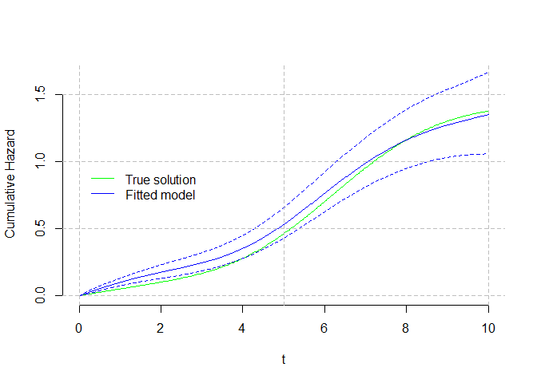
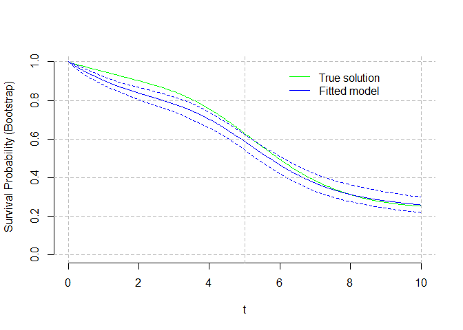

<!-- README.md is generated from README.Rmd. Please edit that file -->

# SplineHazardRegression

<!-- badges: start -->
<!-- badges: end -->

There is no R software available for the direct estimation of hazards
with uncertainty estimation (confidence intervals).

The primary goal of SplineHazardRegression is to make available the
methods for flexible estimation of hazards using (cubic) b-splines
published in Philip S. Rosenberg. “Hazard Function Estimation Using
B-Splines” In Biometrics, Vol. 51, No. 3 (Sep., 1995), pp. 874-887
<https://doi.org/10.2307/2532989> The input data is time-to-event data
(e.g. time to death), possibly right-censored and with late entries
(both meaning that patients are followed-up for unequal times).

The package also allows the flexible estimation of the cumulative hazard
and cumulative survival functions, as well as the compuatation of
aggregate measures for those (average, median, interquartile range,
etc).

Different methods for the automatic selection of knots and for variance
estimation are implemented.

## Installation

You can install the development version of SplineHazardRegression from
[GitHub](https://github.com/) with:

``` r
# install.packages("devtools")
devtools::install_github("fespuny/SplineHazardRegression")
```

## Example

This is a basic example which shows you how to simulate time-to-event
data and fit a hazard function, deriving then cumulative hazard and
survival estimates.

### Data Simulation

``` r
library(SplineHazardRegression)
## simulation parameters
   knots = c(0, 1, 3, 6, 10, NA, NA)
   betac = 1 * c(0.05, 0.05, 0.05, 0.05, 0.40, 0.1, 0.05)
   HParm = data.frame(knots, betac) # 'A Simple B-Spline'
   cll = c(0, 5)
   cup = c(5, 10)
   cih = c(0.0125, 0.025)
   CParm = data.frame(cll, cup, cih) # 'Light Censoring'
## calculate simulation true hazard and censoring distributions
   INPUTS = etsim_inputs( HParam=HParm, CParam=CParm, SampleSize = 201 )
## simulate time-to-event data using true distribution
   SimDat = etsim(INPUTS)
## histogram of the fully observed hazard data (gray) and censored observations (light blue)
hist( SimDat$time[ which(SimDat$status==1)], main="", xlab="t", breaks="Freedman-Diaconis", xlim=c(0,10) )
hist( SimDat$time[ which(SimDat$status==0)], main="", xlab="t", breaks="Freedman-Diaconis", xlim=c(0,10),add=TRUE, col=rgb(173,216,230,max=255,alpha=100) )
```


### Hazard regression

``` r
## Fit a cubic B-spline regression model using the true knots
   yd0= read.csv("C:/local/CORU/Survival Hazard and KM/Philip Rosenberg papers and code/matlab v1 PR/Dataset1.csv", header = F, col.names = c("time","status") )
   SimDat = yd0
   timeout = seq( 0, 10, length.out = 101 )
   Result = hspcore(yd=SimDat, ORDER=4, knots=c(0,1,3,6,10), time=timeout, Bootstrap = 200 )   
#> [1] "K= 3 DOF= 7 knots= 0 0.1 0.3 0.6 1"
#> [1] "L-BFGS-B Convergence (0=yes,1=maxiter)? 0"
#> [1] "PORT Convergence (0=yes)? 0"
#> [1] "Objective L-BFGS-B: 98.4745270384537 Objective PORT: 98.4745270362253"
#> [1] "Optimisation note: The PORT optimization routine was superior to the L-BFGS-B"
#> [1] "Variance estimation using bootstrap"
#> [1] "L-BFGS-B Convergence (0=yes,1=maxiter)? 0"
#> [1] "PORT Convergence (0=yes)? 0"
#> [1] "Objective L-BFGS-B: 77.6022620423231 Objective PORT: 77.6022620190167"
#> [1] "Optimisation note: The PORT optimization routine was superior to the L-BFGS-B"
#> [1] "L-BFGS-B Convergence (0=yes,1=maxiter)? 0"
#> [1] "PORT Convergence (0=yes)? 0"
#> [1] "Objective L-BFGS-B: 93.8174480412482 Objective PORT: 93.8174480394746"
#> [1] "Optimisation note: The PORT optimization routine was superior to the L-BFGS-B"
#> [1] "L-BFGS-B Convergence (0=yes,1=maxiter)? 0"
#> [1] "PORT Convergence (0=yes)? 0"
#> [1] "Objective L-BFGS-B: 85.9907386439734 Objective PORT: 85.9907386247538"
#> [1] "Optimisation note: The PORT optimization routine was superior to the L-BFGS-B"
#> [1] "L-BFGS-B Convergence (0=yes,1=maxiter)? 0"
#> [1] "PORT Convergence (0=yes)? 1"
#> [1] "PORT Warning: false convergence (8)"
#> [1] "L-BFGS-B Convergence (0=yes,1=maxiter)? 0"
#> [1] "PORT Convergence (0=yes)? 0"
#> [1] "Objective L-BFGS-B: 101.026839707479 Objective PORT: 101.026839679659"
#> [1] "Optimisation note: The PORT optimization routine was superior to the L-BFGS-B"
#> [1] "L-BFGS-B Convergence (0=yes,1=maxiter)? 0"
#> [1] "PORT Convergence (0=yes)? 0"
#> [1] "Objective L-BFGS-B: 100.968653996649 Objective PORT: 100.968653978221"
#> [1] "Optimisation note: The PORT optimization routine was superior to the L-BFGS-B"
#> [1] "L-BFGS-B Convergence (0=yes,1=maxiter)? 0"
#> [1] "PORT Convergence (0=yes)? 1"
#> [1] "PORT Warning: false convergence (8)"
#> [1] "L-BFGS-B Convergence (0=yes,1=maxiter)? 0"
#> [1] "PORT Convergence (0=yes)? 0"
#> [1] "Objective L-BFGS-B: 91.5366592794834 Objective PORT: 91.5366592114834"
#> [1] "Optimisation note: The PORT optimization routine was superior to the L-BFGS-B"
#> [1] "L-BFGS-B Convergence (0=yes,1=maxiter)? 0"
#> [1] "PORT Convergence (0=yes)? 1"
#> [1] "PORT Warning: false convergence (8)"
#> [1] "L-BFGS-B Convergence (0=yes,1=maxiter)? 0"
#> [1] "PORT Convergence (0=yes)? 0"
#> [1] "Objective L-BFGS-B: 82.717795680061 Objective PORT: 82.7177956664413"
#> [1] "Optimisation note: The PORT optimization routine was superior to the L-BFGS-B"
#> [1] "L-BFGS-B Convergence (0=yes,1=maxiter)? 0"
#> [1] "PORT Convergence (0=yes)? 0"
#> [1] "Objective L-BFGS-B: 45.974929258638 Objective PORT: 45.9749290966135"
#> [1] "Optimisation note: The PORT optimization routine was superior to the L-BFGS-B"
#> [1] "L-BFGS-B Convergence (0=yes,1=maxiter)? 0"
#> [1] "PORT Convergence (0=yes)? 0"
#> [1] "Objective L-BFGS-B: 97.3502959065493 Objective PORT: 97.3502956902111"
#> [1] "Optimisation note: The PORT optimization routine was superior to the L-BFGS-B"
#> [1] "L-BFGS-B Convergence (0=yes,1=maxiter)? 0"
#> [1] "PORT Convergence (0=yes)? 0"
#> [1] "Objective L-BFGS-B: 87.7150779996743 Objective PORT: 87.7150779978112"
#> [1] "Optimisation note: The PORT optimization routine was superior to the L-BFGS-B"
#> [1] "L-BFGS-B Convergence (0=yes,1=maxiter)? 0"
#> [1] "PORT Convergence (0=yes)? 0"
#> [1] "Objective L-BFGS-B: 80.7590932425023 Objective PORT: 80.7590932421489"
#> [1] "Optimisation note: The PORT optimization routine was superior to the L-BFGS-B"
#> [1] "L-BFGS-B Convergence (0=yes,1=maxiter)? 0"
#> [1] "PORT Convergence (0=yes)? 0"
#> [1] "Objective L-BFGS-B: 94.2708890177378 Objective PORT: 94.2708888808749"
#> [1] "Optimisation note: The PORT optimization routine was superior to the L-BFGS-B"
#> [1] "L-BFGS-B Convergence (0=yes,1=maxiter)? 0"
#> [1] "PORT Convergence (0=yes)? 0"
#> [1] "Objective L-BFGS-B: 104.767742104509 Objective PORT: 104.767742071197"
#> [1] "Optimisation note: The PORT optimization routine was superior to the L-BFGS-B"
#> [1] "L-BFGS-B Convergence (0=yes,1=maxiter)? 0"
#> [1] "PORT Convergence (0=yes)? 0"
#> [1] "Objective L-BFGS-B: 97.2979338791867 Objective PORT: 97.2979338780208"
#> [1] "Optimisation note: The PORT optimization routine was superior to the L-BFGS-B"
#> [1] "L-BFGS-B Convergence (0=yes,1=maxiter)? 0"
#> [1] "PORT Convergence (0=yes)? 0"
#> [1] "Objective L-BFGS-B: 108.557361246007 Objective PORT: 108.557361207046"
#> [1] "Optimisation note: The PORT optimization routine was superior to the L-BFGS-B"
#> [1] "L-BFGS-B Convergence (0=yes,1=maxiter)? 0"
#> [1] "PORT Convergence (0=yes)? 0"
#> [1] "Objective L-BFGS-B: 76.8216453014095 Objective PORT: 76.8216450136963"
#> [1] "Optimisation note: The PORT optimization routine was superior to the L-BFGS-B"
#> [1] "L-BFGS-B Convergence (0=yes,1=maxiter)? 0"
#> [1] "PORT Convergence (0=yes)? 0"
#> [1] "Objective L-BFGS-B: 92.9819988529673 Objective PORT: 92.9819987953947"
#> [1] "Optimisation note: The PORT optimization routine was superior to the L-BFGS-B"
#> [1] "L-BFGS-B Convergence (0=yes,1=maxiter)? 0"
#> [1] "PORT Convergence (0=yes)? 0"
#> [1] "Objective L-BFGS-B: 77.5387022113264 Objective PORT: 77.538702210963"
#> [1] "Optimisation note: The PORT optimization routine was superior to the L-BFGS-B"
#> [1] "L-BFGS-B Convergence (0=yes,1=maxiter)? 0"
#> [1] "PORT Convergence (0=yes)? 0"
#> [1] "Objective L-BFGS-B: 69.5739143540786 Objective PORT: 69.5739143541265"
#> [1] "L-BFGS-B Convergence (0=yes,1=maxiter)? 0"
#> [1] "PORT Convergence (0=yes)? 1"
#> [1] "PORT Warning: false convergence (8)"
#> [1] "L-BFGS-B Convergence (0=yes,1=maxiter)? 0"
#> [1] "PORT Convergence (0=yes)? 0"
#> [1] "Objective L-BFGS-B: 95.3294605886323 Objective PORT: 95.3294605815029"
#> [1] "Optimisation note: The PORT optimization routine was superior to the L-BFGS-B"
#> [1] "L-BFGS-B Convergence (0=yes,1=maxiter)? 0"
#> [1] "PORT Convergence (0=yes)? 0"
#> [1] "Objective L-BFGS-B: 82.9161053724641 Objective PORT: 82.9161053712501"
#> [1] "Optimisation note: The PORT optimization routine was superior to the L-BFGS-B"
#> [1] "L-BFGS-B Convergence (0=yes,1=maxiter)? 0"
#> [1] "PORT Convergence (0=yes)? 0"
#> [1] "Objective L-BFGS-B: 87.5672376793271 Objective PORT: 87.5672376014092"
#> [1] "Optimisation note: The PORT optimization routine was superior to the L-BFGS-B"
#> [1] "L-BFGS-B Convergence (0=yes,1=maxiter)? 0"
#> [1] "PORT Convergence (0=yes)? 0"
#> [1] "Objective L-BFGS-B: 93.548806234682 Objective PORT: 93.5488061806982"
#> [1] "Optimisation note: The PORT optimization routine was superior to the L-BFGS-B"
#> [1] "L-BFGS-B Convergence (0=yes,1=maxiter)? 0"
#> [1] "PORT Convergence (0=yes)? 0"
#> [1] "Objective L-BFGS-B: 92.0331693285702 Objective PORT: 92.0331685498756"
#> [1] "Optimisation note: The PORT optimization routine was superior to the L-BFGS-B"
#> [1] "L-BFGS-B Convergence (0=yes,1=maxiter)? 0"
#> [1] "PORT Convergence (0=yes)? 1"
#> [1] "PORT Warning: false convergence (8)"
#> [1] "L-BFGS-B Convergence (0=yes,1=maxiter)? 0"
#> [1] "PORT Convergence (0=yes)? 1"
#> [1] "PORT Warning: false convergence (8)"
#> [1] "L-BFGS-B Convergence (0=yes,1=maxiter)? 0"
#> [1] "PORT Convergence (0=yes)? 0"
#> [1] "Objective L-BFGS-B: 89.4890946445898 Objective PORT: 89.4890946374613"
#> [1] "Optimisation note: The PORT optimization routine was superior to the L-BFGS-B"
#> [1] "L-BFGS-B Convergence (0=yes,1=maxiter)? 0"
#> [1] "PORT Convergence (0=yes)? 0"
#> [1] "Objective L-BFGS-B: 63.5070464337579 Objective PORT: 63.5070463452179"
#> [1] "Optimisation note: The PORT optimization routine was superior to the L-BFGS-B"
#> [1] "L-BFGS-B Convergence (0=yes,1=maxiter)? 0"
#> [1] "PORT Convergence (0=yes)? 0"
#> [1] "Objective L-BFGS-B: 105.42778961922 Objective PORT: 105.427789608382"
#> [1] "Optimisation note: The PORT optimization routine was superior to the L-BFGS-B"
#> [1] "L-BFGS-B Convergence (0=yes,1=maxiter)? 0"
#> [1] "PORT Convergence (0=yes)? 0"
#> [1] "Objective L-BFGS-B: 77.1416100910106 Objective PORT: 77.1416100759611"
#> [1] "Optimisation note: The PORT optimization routine was superior to the L-BFGS-B"
#> [1] "L-BFGS-B Convergence (0=yes,1=maxiter)? 0"
#> [1] "PORT Convergence (0=yes)? 0"
#> [1] "Objective L-BFGS-B: 88.3293385270551 Objective PORT: 88.3293384682272"
#> [1] "Optimisation note: The PORT optimization routine was superior to the L-BFGS-B"
#> [1] "L-BFGS-B Convergence (0=yes,1=maxiter)? 0"
#> [1] "PORT Convergence (0=yes)? 0"
#> [1] "Objective L-BFGS-B: 80.935223118706 Objective PORT: 80.9352230345339"
#> [1] "Optimisation note: The PORT optimization routine was superior to the L-BFGS-B"
#> [1] "L-BFGS-B Convergence (0=yes,1=maxiter)? 0"
#> [1] "PORT Convergence (0=yes)? 0"
#> [1] "Objective L-BFGS-B: 104.85724859079 Objective PORT: 104.857248501341"
#> [1] "Optimisation note: The PORT optimization routine was superior to the L-BFGS-B"
#> [1] "L-BFGS-B Convergence (0=yes,1=maxiter)? 0"
#> [1] "PORT Convergence (0=yes)? 0"
#> [1] "Objective L-BFGS-B: 88.5247087679363 Objective PORT: 88.524708766246"
#> [1] "Optimisation note: The PORT optimization routine was superior to the L-BFGS-B"
#> [1] "L-BFGS-B Convergence (0=yes,1=maxiter)? 0"
#> [1] "PORT Convergence (0=yes)? 0"
#> [1] "Objective L-BFGS-B: 107.965187381922 Objective PORT: 107.965187381885"
#> [1] "Optimisation note: The PORT optimization routine was superior to the L-BFGS-B"
#> [1] "L-BFGS-B Convergence (0=yes,1=maxiter)? 0"
#> [1] "PORT Convergence (0=yes)? 0"
#> [1] "Objective L-BFGS-B: 99.657294433177 Objective PORT: 99.6572944179677"
#> [1] "Optimisation note: The PORT optimization routine was superior to the L-BFGS-B"
#> [1] "L-BFGS-B Convergence (0=yes,1=maxiter)? 0"
#> [1] "PORT Convergence (0=yes)? 0"
#> [1] "Objective L-BFGS-B: 103.018155778434 Objective PORT: 103.018155690173"
#> [1] "Optimisation note: The PORT optimization routine was superior to the L-BFGS-B"
#> [1] "L-BFGS-B Convergence (0=yes,1=maxiter)? 0"
#> [1] "PORT Convergence (0=yes)? 0"
#> [1] "Objective L-BFGS-B: 101.268067733303 Objective PORT: 101.26806768491"
#> [1] "Optimisation note: The PORT optimization routine was superior to the L-BFGS-B"
#> [1] "L-BFGS-B Convergence (0=yes,1=maxiter)? 0"
#> [1] "PORT Convergence (0=yes)? 0"
#> [1] "Objective L-BFGS-B: 93.185826700623 Objective PORT: 93.1858266396564"
#> [1] "Optimisation note: The PORT optimization routine was superior to the L-BFGS-B"
#> [1] "L-BFGS-B Convergence (0=yes,1=maxiter)? 0"
#> [1] "PORT Convergence (0=yes)? 0"
#> [1] "Objective L-BFGS-B: 89.7635836483618 Objective PORT: 89.7635836358945"
#> [1] "Optimisation note: The PORT optimization routine was superior to the L-BFGS-B"
#> [1] "L-BFGS-B Convergence (0=yes,1=maxiter)? 0"
#> [1] "PORT Convergence (0=yes)? 0"
#> [1] "Objective L-BFGS-B: 99.562283682516 Objective PORT: 99.5622835963256"
#> [1] "Optimisation note: The PORT optimization routine was superior to the L-BFGS-B"
#> [1] "L-BFGS-B Convergence (0=yes,1=maxiter)? 0"
#> [1] "PORT Convergence (0=yes)? 0"
#> [1] "Objective L-BFGS-B: 99.1324323945069 Objective PORT: 99.1324323692146"
#> [1] "Optimisation note: The PORT optimization routine was superior to the L-BFGS-B"
#> [1] "L-BFGS-B Convergence (0=yes,1=maxiter)? 0"
#> [1] "PORT Convergence (0=yes)? 0"
#> [1] "Objective L-BFGS-B: 94.8718908662837 Objective PORT: 94.8718908336552"
#> [1] "Optimisation note: The PORT optimization routine was superior to the L-BFGS-B"
#> [1] "L-BFGS-B Convergence (0=yes,1=maxiter)? 0"
#> [1] "PORT Convergence (0=yes)? 0"
#> [1] "Objective L-BFGS-B: 106.38242405396 Objective PORT: 106.382423854613"
#> [1] "Optimisation note: The PORT optimization routine was superior to the L-BFGS-B"
#> [1] "L-BFGS-B Convergence (0=yes,1=maxiter)? 0"
#> [1] "PORT Convergence (0=yes)? 0"
#> [1] "Objective L-BFGS-B: 88.677961040541 Objective PORT: 88.6779610357059"
#> [1] "Optimisation note: The PORT optimization routine was superior to the L-BFGS-B"
#> [1] "L-BFGS-B Convergence (0=yes,1=maxiter)? 0"
#> [1] "PORT Convergence (0=yes)? 1"
#> [1] "PORT Warning: false convergence (8)"
#> [1] "L-BFGS-B Convergence (0=yes,1=maxiter)? 0"
#> [1] "PORT Convergence (0=yes)? 0"
#> [1] "Objective L-BFGS-B: 107.262128914812 Objective PORT: 107.262128878278"
#> [1] "Optimisation note: The PORT optimization routine was superior to the L-BFGS-B"
#> [1] "L-BFGS-B Convergence (0=yes,1=maxiter)? 0"
#> [1] "PORT Convergence (0=yes)? 0"
#> [1] "Objective L-BFGS-B: 99.2530542796184 Objective PORT: 99.2530542703702"
#> [1] "Optimisation note: The PORT optimization routine was superior to the L-BFGS-B"
#> [1] "L-BFGS-B Convergence (0=yes,1=maxiter)? 0"
#> [1] "PORT Convergence (0=yes)? 0"
#> [1] "Objective L-BFGS-B: 78.8928625920531 Objective PORT: 78.8928621435927"
#> [1] "Optimisation note: The PORT optimization routine was superior to the L-BFGS-B"
#> [1] "L-BFGS-B Convergence (0=yes,1=maxiter)? 0"
#> [1] "PORT Convergence (0=yes)? 0"
#> [1] "Objective L-BFGS-B: 74.2979889940452 Objective PORT: 74.2979889920626"
#> [1] "Optimisation note: The PORT optimization routine was superior to the L-BFGS-B"
#> [1] "L-BFGS-B Convergence (0=yes,1=maxiter)? 0"
#> [1] "PORT Convergence (0=yes)? 0"
#> [1] "Objective L-BFGS-B: 87.7529087086273 Objective PORT: 87.7529087072927"
#> [1] "Optimisation note: The PORT optimization routine was superior to the L-BFGS-B"
#> [1] "L-BFGS-B Convergence (0=yes,1=maxiter)? 0"
#> [1] "PORT Convergence (0=yes)? 0"
#> [1] "Objective L-BFGS-B: 92.0497063891896 Objective PORT: 92.0497063710313"
#> [1] "Optimisation note: The PORT optimization routine was superior to the L-BFGS-B"
#> [1] "L-BFGS-B Convergence (0=yes,1=maxiter)? 0"
#> [1] "PORT Convergence (0=yes)? 1"
#> [1] "PORT Warning: false convergence (8)"
#> [1] "L-BFGS-B Convergence (0=yes,1=maxiter)? 0"
#> [1] "PORT Convergence (0=yes)? 0"
#> [1] "Objective L-BFGS-B: 89.043168423233 Objective PORT: 89.0431684224114"
#> [1] "Optimisation note: The PORT optimization routine was superior to the L-BFGS-B"
#> [1] "L-BFGS-B Convergence (0=yes,1=maxiter)? 0"
#> [1] "PORT Convergence (0=yes)? 0"
#> [1] "Objective L-BFGS-B: 78.0019034359979 Objective PORT: 78.0019034247124"
#> [1] "Optimisation note: The PORT optimization routine was superior to the L-BFGS-B"
#> [1] "L-BFGS-B Convergence (0=yes,1=maxiter)? 0"
#> [1] "PORT Convergence (0=yes)? 0"
#> [1] "Objective L-BFGS-B: 102.267276675873 Objective PORT: 102.267276668175"
#> [1] "Optimisation note: The PORT optimization routine was superior to the L-BFGS-B"
#> [1] "L-BFGS-B Convergence (0=yes,1=maxiter)? 0"
#> [1] "PORT Convergence (0=yes)? 0"
#> [1] "Objective L-BFGS-B: 84.801336850856 Objective PORT: 84.8013368318109"
#> [1] "Optimisation note: The PORT optimization routine was superior to the L-BFGS-B"
#> [1] "L-BFGS-B Convergence (0=yes,1=maxiter)? 0"
#> [1] "PORT Convergence (0=yes)? 0"
#> [1] "Objective L-BFGS-B: 105.30085688146 Objective PORT: 105.300856673726"
#> [1] "Optimisation note: The PORT optimization routine was superior to the L-BFGS-B"
#> [1] "L-BFGS-B Convergence (0=yes,1=maxiter)? 0"
#> [1] "PORT Convergence (0=yes)? 0"
#> [1] "Objective L-BFGS-B: 92.8831521017432 Objective PORT: 92.8831520614457"
#> [1] "Optimisation note: The PORT optimization routine was superior to the L-BFGS-B"
#> [1] "L-BFGS-B Convergence (0=yes,1=maxiter)? 0"
#> [1] "PORT Convergence (0=yes)? 0"
#> [1] "Objective L-BFGS-B: 96.3220116028631 Objective PORT: 96.3220115938562"
#> [1] "Optimisation note: The PORT optimization routine was superior to the L-BFGS-B"
#> [1] "L-BFGS-B Convergence (0=yes,1=maxiter)? 0"
#> [1] "PORT Convergence (0=yes)? 0"
#> [1] "Objective L-BFGS-B: 102.81617699777 Objective PORT: 102.816176974102"
#> [1] "Optimisation note: The PORT optimization routine was superior to the L-BFGS-B"
#> [1] "L-BFGS-B Convergence (0=yes,1=maxiter)? 0"
#> [1] "PORT Convergence (0=yes)? 0"
#> [1] "Objective L-BFGS-B: 102.662106314298 Objective PORT: 102.662106303035"
#> [1] "Optimisation note: The PORT optimization routine was superior to the L-BFGS-B"
#> [1] "L-BFGS-B Convergence (0=yes,1=maxiter)? 0"
#> [1] "PORT Convergence (0=yes)? 0"
#> [1] "Objective L-BFGS-B: 78.4960029138174 Objective PORT: 78.4960029129281"
#> [1] "Optimisation note: The PORT optimization routine was superior to the L-BFGS-B"
#> [1] "L-BFGS-B Convergence (0=yes,1=maxiter)? 0"
#> [1] "PORT Convergence (0=yes)? 0"
#> [1] "Objective L-BFGS-B: 106.048247789608 Objective PORT: 106.048247773924"
#> [1] "Optimisation note: The PORT optimization routine was superior to the L-BFGS-B"
#> [1] "L-BFGS-B Convergence (0=yes,1=maxiter)? 0"
#> [1] "PORT Convergence (0=yes)? 0"
#> [1] "Objective L-BFGS-B: 113.859507448753 Objective PORT: 113.859507435608"
#> [1] "Optimisation note: The PORT optimization routine was superior to the L-BFGS-B"
#> [1] "L-BFGS-B Convergence (0=yes,1=maxiter)? 0"
#> [1] "PORT Convergence (0=yes)? 0"
#> [1] "Objective L-BFGS-B: 105.200218681502 Objective PORT: 105.200218647406"
#> [1] "Optimisation note: The PORT optimization routine was superior to the L-BFGS-B"
#> [1] "L-BFGS-B Convergence (0=yes,1=maxiter)? 0"
#> [1] "PORT Convergence (0=yes)? 0"
#> [1] "Objective L-BFGS-B: 86.4605307486264 Objective PORT: 86.4605307470559"
#> [1] "Optimisation note: The PORT optimization routine was superior to the L-BFGS-B"
#> [1] "L-BFGS-B Convergence (0=yes,1=maxiter)? 0"
#> [1] "PORT Convergence (0=yes)? 0"
#> [1] "Objective L-BFGS-B: 102.922614364552 Objective PORT: 102.922614238315"
#> [1] "Optimisation note: The PORT optimization routine was superior to the L-BFGS-B"
#> [1] "L-BFGS-B Convergence (0=yes,1=maxiter)? 0"
#> [1] "PORT Convergence (0=yes)? 0"
#> [1] "Objective L-BFGS-B: 94.4734128540089 Objective PORT: 94.4734128471217"
#> [1] "Optimisation note: The PORT optimization routine was superior to the L-BFGS-B"
#> [1] "L-BFGS-B Convergence (0=yes,1=maxiter)? 0"
#> [1] "PORT Convergence (0=yes)? 0"
#> [1] "Objective L-BFGS-B: 105.106583150118 Objective PORT: 105.106583034439"
#> [1] "Optimisation note: The PORT optimization routine was superior to the L-BFGS-B"
#> [1] "L-BFGS-B Convergence (0=yes,1=maxiter)? 0"
#> [1] "PORT Convergence (0=yes)? 0"
#> [1] "Objective L-BFGS-B: 89.4677397233117 Objective PORT: 89.4677396518881"
#> [1] "Optimisation note: The PORT optimization routine was superior to the L-BFGS-B"
#> [1] "L-BFGS-B Convergence (0=yes,1=maxiter)? 0"
#> [1] "PORT Convergence (0=yes)? 0"
#> [1] "Objective L-BFGS-B: 85.1319443183551 Objective PORT: 85.1319443181117"
#> [1] "Optimisation note: The PORT optimization routine was superior to the L-BFGS-B"
#> [1] "L-BFGS-B Convergence (0=yes,1=maxiter)? 0"
#> [1] "PORT Convergence (0=yes)? 0"
#> [1] "Objective L-BFGS-B: 89.4781537534798 Objective PORT: 89.4781537190016"
#> [1] "Optimisation note: The PORT optimization routine was superior to the L-BFGS-B"
#> [1] "L-BFGS-B Convergence (0=yes,1=maxiter)? 0"
#> [1] "PORT Convergence (0=yes)? 0"
#> [1] "Objective L-BFGS-B: 91.0160710731561 Objective PORT: 91.0160710618649"
#> [1] "Optimisation note: The PORT optimization routine was superior to the L-BFGS-B"
#> [1] "L-BFGS-B Convergence (0=yes,1=maxiter)? 0"
#> [1] "PORT Convergence (0=yes)? 0"
#> [1] "Objective L-BFGS-B: 110.182137392266 Objective PORT: 110.182137350567"
#> [1] "Optimisation note: The PORT optimization routine was superior to the L-BFGS-B"
#> [1] "L-BFGS-B Convergence (0=yes,1=maxiter)? 0"
#> [1] "PORT Convergence (0=yes)? 0"
#> [1] "Objective L-BFGS-B: 88.4021330554963 Objective PORT: 88.4021330527912"
#> [1] "Optimisation note: The PORT optimization routine was superior to the L-BFGS-B"
#> [1] "L-BFGS-B Convergence (0=yes,1=maxiter)? 0"
#> [1] "PORT Convergence (0=yes)? 0"
#> [1] "Objective L-BFGS-B: 81.4032484052893 Objective PORT: 81.4032484047846"
#> [1] "Optimisation note: The PORT optimization routine was superior to the L-BFGS-B"
#> [1] "L-BFGS-B Convergence (0=yes,1=maxiter)? 0"
#> [1] "PORT Convergence (0=yes)? 0"
#> [1] "Objective L-BFGS-B: 80.9144213585696 Objective PORT: 80.9144213158174"
#> [1] "Optimisation note: The PORT optimization routine was superior to the L-BFGS-B"
#> [1] "L-BFGS-B Convergence (0=yes,1=maxiter)? 0"
#> [1] "PORT Convergence (0=yes)? 0"
#> [1] "Objective L-BFGS-B: 89.9119002522162 Objective PORT: 89.9119002452684"
#> [1] "Optimisation note: The PORT optimization routine was superior to the L-BFGS-B"
#> [1] "L-BFGS-B Convergence (0=yes,1=maxiter)? 0"
#> [1] "PORT Convergence (0=yes)? 0"
#> [1] "Objective L-BFGS-B: 89.1919995138351 Objective PORT: 89.1919995135035"
#> [1] "Optimisation note: The PORT optimization routine was superior to the L-BFGS-B"
#> [1] "L-BFGS-B Convergence (0=yes,1=maxiter)? 0"
#> [1] "PORT Convergence (0=yes)? 1"
#> [1] "PORT Warning: false convergence (8)"
#> [1] "L-BFGS-B Convergence (0=yes,1=maxiter)? 0"
#> [1] "PORT Convergence (0=yes)? 0"
#> [1] "Objective L-BFGS-B: 81.8964926817039 Objective PORT: 81.8964926165829"
#> [1] "Optimisation note: The PORT optimization routine was superior to the L-BFGS-B"
#> [1] "L-BFGS-B Convergence (0=yes,1=maxiter)? 0"
#> [1] "PORT Convergence (0=yes)? 0"
#> [1] "Objective L-BFGS-B: 102.395478184824 Objective PORT: 102.395478010081"
#> [1] "Optimisation note: The PORT optimization routine was superior to the L-BFGS-B"
#> [1] "L-BFGS-B Convergence (0=yes,1=maxiter)? 0"
#> [1] "PORT Convergence (0=yes)? 0"
#> [1] "Objective L-BFGS-B: 84.1301528898827 Objective PORT: 84.1301527706477"
#> [1] "Optimisation note: The PORT optimization routine was superior to the L-BFGS-B"
#> [1] "L-BFGS-B Convergence (0=yes,1=maxiter)? 0"
#> [1] "PORT Convergence (0=yes)? 0"
#> [1] "Objective L-BFGS-B: 78.0344340952537 Objective PORT: 78.0344340884891"
#> [1] "Optimisation note: The PORT optimization routine was superior to the L-BFGS-B"
#> [1] "L-BFGS-B Convergence (0=yes,1=maxiter)? 0"
#> [1] "PORT Convergence (0=yes)? 0"
#> [1] "Objective L-BFGS-B: 85.7258095429018 Objective PORT: 85.7258095411557"
#> [1] "Optimisation note: The PORT optimization routine was superior to the L-BFGS-B"
#> [1] "L-BFGS-B Convergence (0=yes,1=maxiter)? 0"
#> [1] "PORT Convergence (0=yes)? 0"
#> [1] "Objective L-BFGS-B: 82.982058279663 Objective PORT: 82.9820582754856"
#> [1] "Optimisation note: The PORT optimization routine was superior to the L-BFGS-B"
#> [1] "L-BFGS-B Convergence (0=yes,1=maxiter)? 0"
#> [1] "PORT Convergence (0=yes)? 0"
#> [1] "Objective L-BFGS-B: 90.9274590537599 Objective PORT: 90.9274590163979"
#> [1] "Optimisation note: The PORT optimization routine was superior to the L-BFGS-B"
#> [1] "L-BFGS-B Convergence (0=yes,1=maxiter)? 0"
#> [1] "PORT Convergence (0=yes)? 0"
#> [1] "Objective L-BFGS-B: 111.794720700302 Objective PORT: 111.794720684422"
#> [1] "Optimisation note: The PORT optimization routine was superior to the L-BFGS-B"
#> [1] "L-BFGS-B Convergence (0=yes,1=maxiter)? 0"
#> [1] "PORT Convergence (0=yes)? 0"
#> [1] "Objective L-BFGS-B: 80.0909633131016 Objective PORT: 80.0909633078871"
#> [1] "Optimisation note: The PORT optimization routine was superior to the L-BFGS-B"
#> [1] "L-BFGS-B Convergence (0=yes,1=maxiter)? 0"
#> [1] "PORT Convergence (0=yes)? 0"
#> [1] "Objective L-BFGS-B: 99.0194883728507 Objective PORT: 99.0194883565437"
#> [1] "Optimisation note: The PORT optimization routine was superior to the L-BFGS-B"
#> [1] "L-BFGS-B Convergence (0=yes,1=maxiter)? 0"
#> [1] "PORT Convergence (0=yes)? 0"
#> [1] "Objective L-BFGS-B: 92.080143004328 Objective PORT: 92.0801429644576"
#> [1] "Optimisation note: The PORT optimization routine was superior to the L-BFGS-B"
#> [1] "L-BFGS-B Convergence (0=yes,1=maxiter)? 0"
#> [1] "PORT Convergence (0=yes)? 0"
#> [1] "Objective L-BFGS-B: 109.079749666957 Objective PORT: 109.079749666818"
#> [1] "Optimisation note: The PORT optimization routine was superior to the L-BFGS-B"
#> [1] "L-BFGS-B Convergence (0=yes,1=maxiter)? 0"
#> [1] "PORT Convergence (0=yes)? 0"
#> [1] "Objective L-BFGS-B: 75.743413286355 Objective PORT: 75.743413246896"
#> [1] "Optimisation note: The PORT optimization routine was superior to the L-BFGS-B"
#> [1] "L-BFGS-B Convergence (0=yes,1=maxiter)? 0"
#> [1] "PORT Convergence (0=yes)? 0"
#> [1] "Objective L-BFGS-B: 96.9863728323428 Objective PORT: 96.9863728319897"
#> [1] "Optimisation note: The PORT optimization routine was superior to the L-BFGS-B"
#> [1] "L-BFGS-B Convergence (0=yes,1=maxiter)? 0"
#> [1] "PORT Convergence (0=yes)? 0"
#> [1] "Objective L-BFGS-B: 71.8235178762459 Objective PORT: 71.8235178724442"
#> [1] "Optimisation note: The PORT optimization routine was superior to the L-BFGS-B"
#> [1] "L-BFGS-B Convergence (0=yes,1=maxiter)? 0"
#> [1] "PORT Convergence (0=yes)? 0"
#> [1] "Objective L-BFGS-B: 117.908380293833 Objective PORT: 117.908380276927"
#> [1] "Optimisation note: The PORT optimization routine was superior to the L-BFGS-B"
#> [1] "L-BFGS-B Convergence (0=yes,1=maxiter)? 0"
#> [1] "PORT Convergence (0=yes)? 0"
#> [1] "Objective L-BFGS-B: 88.7668174327357 Objective PORT: 88.7668174325466"
#> [1] "Optimisation note: The PORT optimization routine was superior to the L-BFGS-B"
#> [1] "L-BFGS-B Convergence (0=yes,1=maxiter)? 0"
#> [1] "PORT Convergence (0=yes)? 1"
#> [1] "PORT Warning: false convergence (8)"
#> [1] "L-BFGS-B Convergence (0=yes,1=maxiter)? 0"
#> [1] "PORT Convergence (0=yes)? 0"
#> [1] "Objective L-BFGS-B: 83.1794797333411 Objective PORT: 83.1794796989378"
#> [1] "Optimisation note: The PORT optimization routine was superior to the L-BFGS-B"
#> [1] "L-BFGS-B Convergence (0=yes,1=maxiter)? 0"
#> [1] "PORT Convergence (0=yes)? 0"
#> [1] "Objective L-BFGS-B: 85.7760427400544 Objective PORT: 85.776042712647"
#> [1] "Optimisation note: The PORT optimization routine was superior to the L-BFGS-B"
#> [1] "L-BFGS-B Convergence (0=yes,1=maxiter)? 0"
#> [1] "PORT Convergence (0=yes)? 1"
#> [1] "PORT Warning: false convergence (8)"
#> [1] "L-BFGS-B Convergence (0=yes,1=maxiter)? 0"
#> [1] "PORT Convergence (0=yes)? 0"
#> [1] "Objective L-BFGS-B: 101.889789438436 Objective PORT: 101.889789366245"
#> [1] "Optimisation note: The PORT optimization routine was superior to the L-BFGS-B"
#> [1] "L-BFGS-B Convergence (0=yes,1=maxiter)? 0"
#> [1] "PORT Convergence (0=yes)? 0"
#> [1] "Objective L-BFGS-B: 95.8664356379661 Objective PORT: 95.8664356358186"
#> [1] "Optimisation note: The PORT optimization routine was superior to the L-BFGS-B"
#> [1] "L-BFGS-B Convergence (0=yes,1=maxiter)? 0"
#> [1] "PORT Convergence (0=yes)? 0"
#> [1] "Objective L-BFGS-B: 110.664554192658 Objective PORT: 110.664554192069"
#> [1] "Optimisation note: The PORT optimization routine was superior to the L-BFGS-B"
#> [1] "L-BFGS-B Convergence (0=yes,1=maxiter)? 0"
#> [1] "PORT Convergence (0=yes)? 0"
#> [1] "Objective L-BFGS-B: 104.875457147682 Objective PORT: 104.875456981367"
#> [1] "Optimisation note: The PORT optimization routine was superior to the L-BFGS-B"
#> [1] "L-BFGS-B Convergence (0=yes,1=maxiter)? 0"
#> [1] "PORT Convergence (0=yes)? 0"
#> [1] "Objective L-BFGS-B: 89.2771330494652 Objective PORT: 89.2771330475226"
#> [1] "Optimisation note: The PORT optimization routine was superior to the L-BFGS-B"
#> [1] "L-BFGS-B Convergence (0=yes,1=maxiter)? 0"
#> [1] "PORT Convergence (0=yes)? 0"
#> [1] "Objective L-BFGS-B: 92.5794294410771 Objective PORT: 92.5794294350335"
#> [1] "Optimisation note: The PORT optimization routine was superior to the L-BFGS-B"
#> [1] "L-BFGS-B Convergence (0=yes,1=maxiter)? 0"
#> [1] "PORT Convergence (0=yes)? 0"
#> [1] "Objective L-BFGS-B: 108.312725888621 Objective PORT: 108.312725783067"
#> [1] "Optimisation note: The PORT optimization routine was superior to the L-BFGS-B"
#> [1] "L-BFGS-B Convergence (0=yes,1=maxiter)? 0"
#> [1] "PORT Convergence (0=yes)? 0"
#> [1] "Objective L-BFGS-B: 105.255125757563 Objective PORT: 105.255125756722"
#> [1] "Optimisation note: The PORT optimization routine was superior to the L-BFGS-B"
#> [1] "L-BFGS-B Convergence (0=yes,1=maxiter)? 0"
#> [1] "PORT Convergence (0=yes)? 0"
#> [1] "Objective L-BFGS-B: 105.928925752389 Objective PORT: 105.928925752088"
#> [1] "Optimisation note: The PORT optimization routine was superior to the L-BFGS-B"
#> [1] "L-BFGS-B Convergence (0=yes,1=maxiter)? 0"
#> [1] "PORT Convergence (0=yes)? 0"
#> [1] "Objective L-BFGS-B: 107.221865715717 Objective PORT: 107.221865715622"
#> [1] "Optimisation note: The PORT optimization routine was superior to the L-BFGS-B"
#> [1] "L-BFGS-B Convergence (0=yes,1=maxiter)? 0"
#> [1] "PORT Convergence (0=yes)? 0"
#> [1] "Objective L-BFGS-B: 97.3172870842795 Objective PORT: 97.3172870838176"
#> [1] "Optimisation note: The PORT optimization routine was superior to the L-BFGS-B"
#> [1] "L-BFGS-B Convergence (0=yes,1=maxiter)? 0"
#> [1] "PORT Convergence (0=yes)? 0"
#> [1] "Objective L-BFGS-B: 87.1657600012516 Objective PORT: 87.1657599836409"
#> [1] "Optimisation note: The PORT optimization routine was superior to the L-BFGS-B"
#> [1] "L-BFGS-B Convergence (0=yes,1=maxiter)? 0"
#> [1] "PORT Convergence (0=yes)? 0"
#> [1] "Objective L-BFGS-B: 105.712834686919 Objective PORT: 105.712834678294"
#> [1] "Optimisation note: The PORT optimization routine was superior to the L-BFGS-B"
#> [1] "L-BFGS-B Convergence (0=yes,1=maxiter)? 0"
#> [1] "PORT Convergence (0=yes)? 0"
#> [1] "Objective L-BFGS-B: 57.6890046398088 Objective PORT: 57.6890046356533"
#> [1] "Optimisation note: The PORT optimization routine was superior to the L-BFGS-B"
#> [1] "L-BFGS-B Convergence (0=yes,1=maxiter)? 0"
#> [1] "PORT Convergence (0=yes)? 0"
#> [1] "Objective L-BFGS-B: 78.6907985638246 Objective PORT: 78.6907985355591"
#> [1] "Optimisation note: The PORT optimization routine was superior to the L-BFGS-B"
#> [1] "L-BFGS-B Convergence (0=yes,1=maxiter)? 0"
#> [1] "PORT Convergence (0=yes)? 0"
#> [1] "Objective L-BFGS-B: 107.507964407246 Objective PORT: 107.507964287471"
#> [1] "Optimisation note: The PORT optimization routine was superior to the L-BFGS-B"
#> [1] "L-BFGS-B Convergence (0=yes,1=maxiter)? 0"
#> [1] "PORT Convergence (0=yes)? 0"
#> [1] "Objective L-BFGS-B: 84.9565199052627 Objective PORT: 84.9565198904943"
#> [1] "Optimisation note: The PORT optimization routine was superior to the L-BFGS-B"
#> [1] "L-BFGS-B Convergence (0=yes,1=maxiter)? 0"
#> [1] "PORT Convergence (0=yes)? 0"
#> [1] "Objective L-BFGS-B: 70.6621580973789 Objective PORT: 70.6621580872476"
#> [1] "Optimisation note: The PORT optimization routine was superior to the L-BFGS-B"
#> [1] "L-BFGS-B Convergence (0=yes,1=maxiter)? 0"
#> [1] "PORT Convergence (0=yes)? 0"
#> [1] "Objective L-BFGS-B: 98.9889899608796 Objective PORT: 98.988989894305"
#> [1] "Optimisation note: The PORT optimization routine was superior to the L-BFGS-B"
#> [1] "L-BFGS-B Convergence (0=yes,1=maxiter)? 0"
#> [1] "PORT Convergence (0=yes)? 0"
#> [1] "Objective L-BFGS-B: 90.6709207247594 Objective PORT: 90.6709204113152"
#> [1] "Optimisation note: The PORT optimization routine was superior to the L-BFGS-B"
#> [1] "L-BFGS-B Convergence (0=yes,1=maxiter)? 0"
#> [1] "PORT Convergence (0=yes)? 0"
#> [1] "Objective L-BFGS-B: 100.635258986819 Objective PORT: 100.635258984822"
#> [1] "Optimisation note: The PORT optimization routine was superior to the L-BFGS-B"
#> [1] "L-BFGS-B Convergence (0=yes,1=maxiter)? 0"
#> [1] "PORT Convergence (0=yes)? 0"
#> [1] "Objective L-BFGS-B: 90.3519330442244 Objective PORT: 90.3519329349027"
#> [1] "Optimisation note: The PORT optimization routine was superior to the L-BFGS-B"
#> [1] "L-BFGS-B Convergence (0=yes,1=maxiter)? 0"
#> [1] "PORT Convergence (0=yes)? 0"
#> [1] "Objective L-BFGS-B: 84.6145402548066 Objective PORT: 84.614540251556"
#> [1] "Optimisation note: The PORT optimization routine was superior to the L-BFGS-B"
#> [1] "L-BFGS-B Convergence (0=yes,1=maxiter)? 0"
#> [1] "PORT Convergence (0=yes)? 1"
#> [1] "PORT Warning: false convergence (8)"
#> [1] "L-BFGS-B Convergence (0=yes,1=maxiter)? 0"
#> [1] "PORT Convergence (0=yes)? 0"
#> [1] "Objective L-BFGS-B: 64.9198330826701 Objective PORT: 64.919833082644"
#> [1] "Optimisation note: The PORT optimization routine was superior to the L-BFGS-B"
#> [1] "L-BFGS-B Convergence (0=yes,1=maxiter)? 0"
#> [1] "PORT Convergence (0=yes)? 0"
#> [1] "Objective L-BFGS-B: 103.538180012405 Objective PORT: 103.538179958911"
#> [1] "Optimisation note: The PORT optimization routine was superior to the L-BFGS-B"
#> [1] "L-BFGS-B Convergence (0=yes,1=maxiter)? 0"
#> [1] "PORT Convergence (0=yes)? 0"
#> [1] "Objective L-BFGS-B: 113.748001338352 Objective PORT: 113.748001306979"
#> [1] "Optimisation note: The PORT optimization routine was superior to the L-BFGS-B"
#> [1] "L-BFGS-B Convergence (0=yes,1=maxiter)? 0"
#> [1] "PORT Convergence (0=yes)? 0"
#> [1] "Objective L-BFGS-B: 82.5090933507465 Objective PORT: 82.5090933501595"
#> [1] "Optimisation note: The PORT optimization routine was superior to the L-BFGS-B"
#> [1] "L-BFGS-B Convergence (0=yes,1=maxiter)? 0"
#> [1] "PORT Convergence (0=yes)? 0"
#> [1] "Objective L-BFGS-B: 98.6287405078421 Objective PORT: 98.6287403555023"
#> [1] "Optimisation note: The PORT optimization routine was superior to the L-BFGS-B"
#> [1] "L-BFGS-B Convergence (0=yes,1=maxiter)? 0"
#> [1] "PORT Convergence (0=yes)? 0"
#> [1] "Objective L-BFGS-B: 108.673798806071 Objective PORT: 108.673798805739"
#> [1] "Optimisation note: The PORT optimization routine was superior to the L-BFGS-B"
#> [1] "L-BFGS-B Convergence (0=yes,1=maxiter)? 0"
#> [1] "PORT Convergence (0=yes)? 0"
#> [1] "Objective L-BFGS-B: 94.228071964001 Objective PORT: 94.2280719494535"
#> [1] "Optimisation note: The PORT optimization routine was superior to the L-BFGS-B"
#> [1] "L-BFGS-B Convergence (0=yes,1=maxiter)? 0"
#> [1] "PORT Convergence (0=yes)? 0"
#> [1] "Objective L-BFGS-B: 103.22948716457 Objective PORT: 103.229487059561"
#> [1] "Optimisation note: The PORT optimization routine was superior to the L-BFGS-B"
#> [1] "L-BFGS-B Convergence (0=yes,1=maxiter)? 0"
#> [1] "PORT Convergence (0=yes)? 0"
#> [1] "Objective L-BFGS-B: 86.7468899398787 Objective PORT: 86.746889939798"
#> [1] "Optimisation note: The PORT optimization routine was superior to the L-BFGS-B"
#> [1] "L-BFGS-B Convergence (0=yes,1=maxiter)? 0"
#> [1] "PORT Convergence (0=yes)? 0"
#> [1] "Objective L-BFGS-B: 81.524273508328 Objective PORT: 81.5242735049775"
#> [1] "Optimisation note: The PORT optimization routine was superior to the L-BFGS-B"
#> [1] "L-BFGS-B Convergence (0=yes,1=maxiter)? 0"
#> [1] "PORT Convergence (0=yes)? 0"
#> [1] "Objective L-BFGS-B: 85.554939470856 Objective PORT: 85.5549394636186"
#> [1] "Optimisation note: The PORT optimization routine was superior to the L-BFGS-B"
#> [1] "L-BFGS-B Convergence (0=yes,1=maxiter)? 0"
#> [1] "PORT Convergence (0=yes)? 0"
#> [1] "Objective L-BFGS-B: 72.0075821490265 Objective PORT: 72.0075821487314"
#> [1] "Optimisation note: The PORT optimization routine was superior to the L-BFGS-B"
#> [1] "L-BFGS-B Convergence (0=yes,1=maxiter)? 0"
#> [1] "PORT Convergence (0=yes)? 0"
#> [1] "Objective L-BFGS-B: 96.0089631392619 Objective PORT: 96.0089630976243"
#> [1] "Optimisation note: The PORT optimization routine was superior to the L-BFGS-B"
#> [1] "L-BFGS-B Convergence (0=yes,1=maxiter)? 0"
#> [1] "PORT Convergence (0=yes)? 0"
#> [1] "Objective L-BFGS-B: 85.3297979840934 Objective PORT: 85.3297979789551"
#> [1] "Optimisation note: The PORT optimization routine was superior to the L-BFGS-B"
#> [1] "L-BFGS-B Convergence (0=yes,1=maxiter)? 0"
#> [1] "PORT Convergence (0=yes)? 0"
#> [1] "Objective L-BFGS-B: 65.0482371392386 Objective PORT: 65.0482371390683"
#> [1] "Optimisation note: The PORT optimization routine was superior to the L-BFGS-B"
#> [1] "L-BFGS-B Convergence (0=yes,1=maxiter)? 0"
#> [1] "PORT Convergence (0=yes)? 0"
#> [1] "Objective L-BFGS-B: 83.493288650862 Objective PORT: 83.4932886481382"
#> [1] "Optimisation note: The PORT optimization routine was superior to the L-BFGS-B"
#> [1] "L-BFGS-B Convergence (0=yes,1=maxiter)? 0"
#> [1] "PORT Convergence (0=yes)? 0"
#> [1] "Objective L-BFGS-B: 92.1655027195712 Objective PORT: 92.1655027162017"
#> [1] "Optimisation note: The PORT optimization routine was superior to the L-BFGS-B"
#> [1] "L-BFGS-B Convergence (0=yes,1=maxiter)? 0"
#> [1] "PORT Convergence (0=yes)? 1"
#> [1] "PORT Warning: false convergence (8)"
#> [1] "L-BFGS-B Convergence (0=yes,1=maxiter)? 0"
#> [1] "PORT Convergence (0=yes)? 0"
#> [1] "Objective L-BFGS-B: 106.542783894044 Objective PORT: 106.542783659678"
#> [1] "Optimisation note: The PORT optimization routine was superior to the L-BFGS-B"
#> [1] "L-BFGS-B Convergence (0=yes,1=maxiter)? 0"
#> [1] "PORT Convergence (0=yes)? 0"
#> [1] "Objective L-BFGS-B: 112.223881578207 Objective PORT: 112.223881551799"
#> [1] "Optimisation note: The PORT optimization routine was superior to the L-BFGS-B"
#> [1] "L-BFGS-B Convergence (0=yes,1=maxiter)? 0"
#> [1] "PORT Convergence (0=yes)? 0"
#> [1] "Objective L-BFGS-B: 98.9788937566753 Objective PORT: 98.978893563398"
#> [1] "Optimisation note: The PORT optimization routine was superior to the L-BFGS-B"
#> [1] "L-BFGS-B Convergence (0=yes,1=maxiter)? 0"
#> [1] "PORT Convergence (0=yes)? 0"
#> [1] "Objective L-BFGS-B: 100.667977150659 Objective PORT: 100.667977148794"
#> [1] "Optimisation note: The PORT optimization routine was superior to the L-BFGS-B"
#> [1] "L-BFGS-B Convergence (0=yes,1=maxiter)? 0"
#> [1] "PORT Convergence (0=yes)? 1"
#> [1] "PORT Warning: false convergence (8)"
#> [1] "L-BFGS-B Convergence (0=yes,1=maxiter)? 0"
#> [1] "PORT Convergence (0=yes)? 0"
#> [1] "Objective L-BFGS-B: 91.0932358033464 Objective PORT: 91.0932357939843"
#> [1] "Optimisation note: The PORT optimization routine was superior to the L-BFGS-B"
#> [1] "L-BFGS-B Convergence (0=yes,1=maxiter)? 0"
#> [1] "PORT Convergence (0=yes)? 0"
#> [1] "Objective L-BFGS-B: 89.1473679631562 Objective PORT: 89.1473679496483"
#> [1] "Optimisation note: The PORT optimization routine was superior to the L-BFGS-B"
#> [1] "L-BFGS-B Convergence (0=yes,1=maxiter)? 0"
#> [1] "PORT Convergence (0=yes)? 0"
#> [1] "Objective L-BFGS-B: 86.2668244977797 Objective PORT: 86.266824497619"
#> [1] "Optimisation note: The PORT optimization routine was superior to the L-BFGS-B"
#> [1] "L-BFGS-B Convergence (0=yes,1=maxiter)? 0"
#> [1] "PORT Convergence (0=yes)? 0"
#> [1] "Objective L-BFGS-B: 76.6387999505015 Objective PORT: 76.6387999158302"
#> [1] "Optimisation note: The PORT optimization routine was superior to the L-BFGS-B"
#> [1] "L-BFGS-B Convergence (0=yes,1=maxiter)? 0"
#> [1] "PORT Convergence (0=yes)? 0"
#> [1] "Objective L-BFGS-B: 109.312480072245 Objective PORT: 109.312480035242"
#> [1] "Optimisation note: The PORT optimization routine was superior to the L-BFGS-B"
#> [1] "L-BFGS-B Convergence (0=yes,1=maxiter)? 0"
#> [1] "PORT Convergence (0=yes)? 0"
#> [1] "Objective L-BFGS-B: 108.632051167668 Objective PORT: 108.632051125226"
#> [1] "Optimisation note: The PORT optimization routine was superior to the L-BFGS-B"
#> [1] "L-BFGS-B Convergence (0=yes,1=maxiter)? 0"
#> [1] "PORT Convergence (0=yes)? 0"
#> [1] "Objective L-BFGS-B: 83.8639619634158 Objective PORT: 83.8639619632895"
#> [1] "Optimisation note: The PORT optimization routine was superior to the L-BFGS-B"
#> [1] "L-BFGS-B Convergence (0=yes,1=maxiter)? 0"
#> [1] "PORT Convergence (0=yes)? 0"
#> [1] "Objective L-BFGS-B: 82.8966332721872 Objective PORT: 82.8966332684488"
#> [1] "Optimisation note: The PORT optimization routine was superior to the L-BFGS-B"
#> [1] "L-BFGS-B Convergence (0=yes,1=maxiter)? 0"
#> [1] "PORT Convergence (0=yes)? 0"
#> [1] "Objective L-BFGS-B: 103.519749830425 Objective PORT: 103.519749685939"
#> [1] "Optimisation note: The PORT optimization routine was superior to the L-BFGS-B"
#> [1] "L-BFGS-B Convergence (0=yes,1=maxiter)? 0"
#> [1] "PORT Convergence (0=yes)? 0"
#> [1] "Objective L-BFGS-B: 112.073793346425 Objective PORT: 112.073793341912"
#> [1] "Optimisation note: The PORT optimization routine was superior to the L-BFGS-B"
#> [1] "L-BFGS-B Convergence (0=yes,1=maxiter)? 0"
#> [1] "PORT Convergence (0=yes)? 0"
#> [1] "Objective L-BFGS-B: 110.182300348795 Objective PORT: 110.182300321557"
#> [1] "Optimisation note: The PORT optimization routine was superior to the L-BFGS-B"
#> [1] "L-BFGS-B Convergence (0=yes,1=maxiter)? 0"
#> [1] "PORT Convergence (0=yes)? 0"
#> [1] "Objective L-BFGS-B: 99.1633507324306 Objective PORT: 99.163350703421"
#> [1] "Optimisation note: The PORT optimization routine was superior to the L-BFGS-B"
#> [1] "L-BFGS-B Convergence (0=yes,1=maxiter)? 0"
#> [1] "PORT Convergence (0=yes)? 0"
#> [1] "Objective L-BFGS-B: 92.4488073806966 Objective PORT: 92.4488073551093"
#> [1] "Optimisation note: The PORT optimization routine was superior to the L-BFGS-B"
#> [1] "L-BFGS-B Convergence (0=yes,1=maxiter)? 0"
#> [1] "PORT Convergence (0=yes)? 0"
#> [1] "Objective L-BFGS-B: 87.5918043937587 Objective PORT: 87.5918043473375"
#> [1] "Optimisation note: The PORT optimization routine was superior to the L-BFGS-B"
#> [1] "L-BFGS-B Convergence (0=yes,1=maxiter)? 0"
#> [1] "PORT Convergence (0=yes)? 0"
#> [1] "Objective L-BFGS-B: 102.348268943029 Objective PORT: 102.348268938204"
#> [1] "Optimisation note: The PORT optimization routine was superior to the L-BFGS-B"
#> [1] "L-BFGS-B Convergence (0=yes,1=maxiter)? 0"
#> [1] "PORT Convergence (0=yes)? 0"
#> [1] "Objective L-BFGS-B: 89.250915849114 Objective PORT: 89.2509158489485"
#> [1] "Optimisation note: The PORT optimization routine was superior to the L-BFGS-B"
#> [1] "L-BFGS-B Convergence (0=yes,1=maxiter)? 0"
#> [1] "PORT Convergence (0=yes)? 0"
#> [1] "Objective L-BFGS-B: 99.5774347048453 Objective PORT: 99.5774347046389"
#> [1] "Optimisation note: The PORT optimization routine was superior to the L-BFGS-B"
#> [1] "L-BFGS-B Convergence (0=yes,1=maxiter)? 0"
#> [1] "PORT Convergence (0=yes)? 0"
#> [1] "Objective L-BFGS-B: 88.3518178314144 Objective PORT: 88.3518178296247"
#> [1] "Optimisation note: The PORT optimization routine was superior to the L-BFGS-B"
#> [1] "L-BFGS-B Convergence (0=yes,1=maxiter)? 0"
#> [1] "PORT Convergence (0=yes)? 0"
#> [1] "Objective L-BFGS-B: 101.478687396461 Objective PORT: 101.478687369555"
#> [1] "Optimisation note: The PORT optimization routine was superior to the L-BFGS-B"
#> [1] "L-BFGS-B Convergence (0=yes,1=maxiter)? 0"
#> [1] "PORT Convergence (0=yes)? 0"
#> [1] "Objective L-BFGS-B: 94.4999829772868 Objective PORT: 94.4999829761153"
#> [1] "Optimisation note: The PORT optimization routine was superior to the L-BFGS-B"
#> [1] "L-BFGS-B Convergence (0=yes,1=maxiter)? 0"
#> [1] "PORT Convergence (0=yes)? 0"
#> [1] "Objective L-BFGS-B: 99.080368566955 Objective PORT: 99.0803685498328"
#> [1] "Optimisation note: The PORT optimization routine was superior to the L-BFGS-B"
#> [1] "L-BFGS-B Convergence (0=yes,1=maxiter)? 0"
#> [1] "PORT Convergence (0=yes)? 0"
#> [1] "Objective L-BFGS-B: 88.4791086931455 Objective PORT: 88.479108692491"
#> [1] "Optimisation note: The PORT optimization routine was superior to the L-BFGS-B"
#> [1] "L-BFGS-B Convergence (0=yes,1=maxiter)? 0"
#> [1] "PORT Convergence (0=yes)? 0"
#> [1] "Objective L-BFGS-B: 87.8722887063458 Objective PORT: 87.8722887062396"
#> [1] "Optimisation note: The PORT optimization routine was superior to the L-BFGS-B"
#> [1] "L-BFGS-B Convergence (0=yes,1=maxiter)? 0"
#> [1] "PORT Convergence (0=yes)? 0"
#> [1] "Objective L-BFGS-B: 80.5500729520081 Objective PORT: 80.5500728295601"
#> [1] "Optimisation note: The PORT optimization routine was superior to the L-BFGS-B"
#> [1] "L-BFGS-B Convergence (0=yes,1=maxiter)? 0"
#> [1] "PORT Convergence (0=yes)? 0"
#> [1] "Objective L-BFGS-B: 70.3657767017162 Objective PORT: 70.3657766863732"
#> [1] "Optimisation note: The PORT optimization routine was superior to the L-BFGS-B"
#> [1] "L-BFGS-B Convergence (0=yes,1=maxiter)? 0"
#> [1] "PORT Convergence (0=yes)? 1"
#> [1] "PORT Warning: false convergence (8)"
#> [1] "L-BFGS-B Convergence (0=yes,1=maxiter)? 0"
#> [1] "PORT Convergence (0=yes)? 0"
#> [1] "Objective L-BFGS-B: 96.7315997843598 Objective PORT: 96.7315997673433"
#> [1] "Optimisation note: The PORT optimization routine was superior to the L-BFGS-B"
#> [1] "L-BFGS-B Convergence (0=yes,1=maxiter)? 0"
#> [1] "PORT Convergence (0=yes)? 0"
#> [1] "Objective L-BFGS-B: 117.30139720181 Objective PORT: 117.301397122952"
#> [1] "Optimisation note: The PORT optimization routine was superior to the L-BFGS-B"
#> [1] "L-BFGS-B Convergence (0=yes,1=maxiter)? 0"
#> [1] "PORT Convergence (0=yes)? 0"
#> [1] "Objective L-BFGS-B: 100.248559073175 Objective PORT: 100.248559067177"
#> [1] "Optimisation note: The PORT optimization routine was superior to the L-BFGS-B"
#> [1] "L-BFGS-B Convergence (0=yes,1=maxiter)? 0"
#> [1] "PORT Convergence (0=yes)? 0"
#> [1] "Objective L-BFGS-B: 108.585122989618 Objective PORT: 108.585122982808"
#> [1] "Optimisation note: The PORT optimization routine was superior to the L-BFGS-B"
#> [1] "L-BFGS-B Convergence (0=yes,1=maxiter)? 0"
#> [1] "PORT Convergence (0=yes)? 1"
#> [1] "PORT Warning: false convergence (8)"
#> [1] "L-BFGS-B Convergence (0=yes,1=maxiter)? 0"
#> [1] "PORT Convergence (0=yes)? 0"
#> [1] "Objective L-BFGS-B: 72.8832591631186 Objective PORT: 72.8832591619737"
#> [1] "Optimisation note: The PORT optimization routine was superior to the L-BFGS-B"
#> [1] "L-BFGS-B Convergence (0=yes,1=maxiter)? 0"
#> [1] "PORT Convergence (0=yes)? 0"
#> [1] "Objective L-BFGS-B: 76.7374060620754 Objective PORT: 76.7374060560516"
#> [1] "Optimisation note: The PORT optimization routine was superior to the L-BFGS-B"
#> [1] "L-BFGS-B Convergence (0=yes,1=maxiter)? 0"
#> [1] "PORT Convergence (0=yes)? 0"
#> [1] "Objective L-BFGS-B: 89.5849563535684 Objective PORT: 89.5849560251092"
#> [1] "Optimisation note: The PORT optimization routine was superior to the L-BFGS-B"
#> [1] "L-BFGS-B Convergence (0=yes,1=maxiter)? 0"
#> [1] "PORT Convergence (0=yes)? 0"
#> [1] "Objective L-BFGS-B: 93.778367622821 Objective PORT: 93.7783675764074"
#> [1] "Optimisation note: The PORT optimization routine was superior to the L-BFGS-B"
#> [1] "L-BFGS-B Convergence (0=yes,1=maxiter)? 0"
#> [1] "PORT Convergence (0=yes)? 1"
#> [1] "PORT Warning: false convergence (8)"
#> [1] "L-BFGS-B Convergence (0=yes,1=maxiter)? 0"
#> [1] "PORT Convergence (0=yes)? 0"
#> [1] "Objective L-BFGS-B: 94.9757979578146 Objective PORT: 94.975797903976"
#> [1] "Optimisation note: The PORT optimization routine was superior to the L-BFGS-B"
#> [1] "L-BFGS-B Convergence (0=yes,1=maxiter)? 0"
#> [1] "PORT Convergence (0=yes)? 0"
#> [1] "Objective L-BFGS-B: 89.6438360703616 Objective PORT: 89.6438360665313"
#> [1] "Optimisation note: The PORT optimization routine was superior to the L-BFGS-B"
#> [1] "L-BFGS-B Convergence (0=yes,1=maxiter)? 0"
#> [1] "PORT Convergence (0=yes)? 0"
#> [1] "Objective L-BFGS-B: 90.0309239676272 Objective PORT: 90.0309239638712"
#> [1] "Optimisation note: The PORT optimization routine was superior to the L-BFGS-B"
#> [1] "L-BFGS-B Convergence (0=yes,1=maxiter)? 0"
#> [1] "PORT Convergence (0=yes)? 0"
#> [1] "Objective L-BFGS-B: 94.0832708732142 Objective PORT: 94.0832707967566"
#> [1] "Optimisation note: The PORT optimization routine was superior to the L-BFGS-B"
#> [1] "L-BFGS-B Convergence (0=yes,1=maxiter)? 0"
#> [1] "PORT Convergence (0=yes)? 0"
#> [1] "Objective L-BFGS-B: 75.8956871935386 Objective PORT: 75.8956871766704"
#> [1] "Optimisation note: The PORT optimization routine was superior to the L-BFGS-B"
#> [1] "L-BFGS-B Convergence (0=yes,1=maxiter)? 0"
#> [1] "PORT Convergence (0=yes)? 0"
#> [1] "Objective L-BFGS-B: 68.265505824815 Objective PORT: 68.2655057988887"
#> [1] "Optimisation note: The PORT optimization routine was superior to the L-BFGS-B"
#> [1] "L-BFGS-B Convergence (0=yes,1=maxiter)? 0"
#> [1] "PORT Convergence (0=yes)? 0"
#> [1] "Objective L-BFGS-B: 116.56428784832 Objective PORT: 116.56428784272"
#> [1] "Optimisation note: The PORT optimization routine was superior to the L-BFGS-B"
#> [1] "L-BFGS-B Convergence (0=yes,1=maxiter)? 0"
#> [1] "PORT Convergence (0=yes)? 0"
#> [1] "Objective L-BFGS-B: 79.0806481658988 Objective PORT: 79.0806481503323"
#> [1] "Optimisation note: The PORT optimization routine was superior to the L-BFGS-B"
#> [1] "L-BFGS-B Convergence (0=yes,1=maxiter)? 0"
#> [1] "PORT Convergence (0=yes)? 0"
#> [1] "Objective L-BFGS-B: 94.3138209161184 Objective PORT: 94.3138208841314"
#> [1] "Optimisation note: The PORT optimization routine was superior to the L-BFGS-B"
#> [1] "L-BFGS-B Convergence (0=yes,1=maxiter)? 0"
#> [1] "PORT Convergence (0=yes)? 1"
#> [1] "PORT Warning: false convergence (8)"
#> [1] "L-BFGS-B Convergence (0=yes,1=maxiter)? 0"
#> [1] "PORT Convergence (0=yes)? 0"
#> [1] "Objective L-BFGS-B: 77.9508713188642 Objective PORT: 77.950871204331"
#> [1] "Optimisation note: The PORT optimization routine was superior to the L-BFGS-B"
```



## PACKAGE DEVELOPMENT NOTE

You’ll still need to render `README.Rmd` regularly, to keep `README.md`
up-to-date. `devtools::build_readme()` is handy for this. In that case,
don’t forget to commit and push the resulting figure files, so they
display on GitHub and CRAN.
