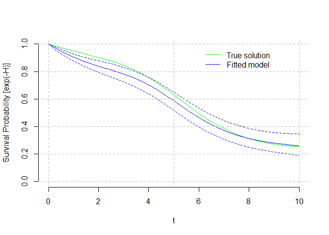

<!-- README.md is generated from README.Rmd. Please edit that file -->

# SplineHazardRegression

<!-- badges: start -->
<!-- badges: end -->

There is no R software available for the direct estimation of hazards
with uncertainty estimation (confidence intervals).

The primary goal of SplineHazardRegression is to make available the
methods for flexible estimation of hazards using (cubic) b-splines
published in Philip S. Rosenberg. “Hazard Function Estimation Using
B-Splines” In Biometrics, Vol. 51, No. 3 (Sep., 1995), pp. 874-887
<https://doi.org/10.2307/2532989> The input data is time-to-event data
(e.g. time to death), possibly right-censored and with late entries
(both meaning that patients are followed-up for unequal times).

The package also allows the flexible estimation of the cumulative hazard
and cumulative survival functions, as well as the computation of
aggregate measures for those (average, median, interquartile range,
etc).

Different methods for the automatic selection of knots and for variance
estimation are implemented.

## Installation

You can install the development version of SplineHazardRegression from
[GitHub](https://github.com/) with:

``` r
# install.packages("devtools")
devtools::install_github("fespuny/SplineHazardRegression")
```

## Example

This is a basic example which shows you how to simulate time-to-event
data and fit a hazard function, deriving then cumulative hazard and
survival estimates.

### Data Simulation

``` r
library(SplineHazardRegression)
## simulation parameters
   knots = c(0, 1, 3, 6, 10, NA, NA)
   betac = 1 * c(0.05, 0.05, 0.05, 0.05, 0.40, 0.1, 0.05)
   HParm = data.frame(knots, betac) # 'A Simple B-Spline'
   cll = c(0, 5)
   cup = c(5, 10)
   cih = c(0.0125, 0.025)
   CParm = data.frame(cll, cup, cih) # 'Light Censoring'
## calculate simulation true hazard and censoring distributions
   INPUTS = etsim_inputs( HParam=HParm, CParam=CParm, SampleSize = 301 )
## simulate time-to-event data using true distribution
   SimDat = etsim(INPUTS)
## histogram of the fully observed hazard data (gray) and censored observations (light blue)
hist( SimDat$time[ which(SimDat$status==1)], main="", xlab="t", breaks="Freedman-Diaconis", xlim=c(0,10) )
hist( SimDat$time[ which(SimDat$status==0)], main="", xlab="t", breaks="Freedman-Diaconis", xlim=c(0,10),add=TRUE, col=rgb(173,216,230,max=255,alpha=100) )
```


### Hazard regression

``` r
## Fit a cubic B-spline regression model using the true knots
   # yd0= read.csv("C:/local/CORU/Survival Hazard and KM/Philip Rosenberg papers and code/matlab v1 PR/Dataset1.csv", header = F, col.names = c("time","status") )
   # SimDat = yd0
   timeout = seq( 0, 10, length.out = 101 )
   # Result = hspcore(yd=SimDat, ORDER=4, knots=c(0,1,3,6,10), time=timeout, Bootstrap = 120, verbose=FALSE )   
   Result = hspcore(yd=SimDat, ORDER=4, Exterior.knots = c(0,10), Interior.knots=NULL, SelectBestKnots = TRUE, time=timeout, Bootstrap = 220, verbose=FALSE )  
#> [1] "Automatic search for K the number of interior knots of the B-spline hazard function"
#> [1] "K= 1 AICc=98.8369107313701 knots= 0 0.5 1"
#> [1] "K= 2 AICc=101.72570941807 knots= 0 0.3 0.6 1"
#> [1] "K= 3 AICc=101.893346310461 knots= 0 0.3 0.5 0.6 1"
#> [1] "K= 4 AICc=99.5429790656955 knots= 0 0.2 0.4 0.5 0.7 1"
#> [1] "K= 5 AICc=103.821219138625 knots= 0 0.2 0.3 0.5 0.6 0.7 1"
#> [1] "K= 6 AICc=70.5968005410835 knots= 0 0.2 0.3 0.4 0.5 0.6 0.7 1"
#> [1] "K= 7 AICc=107.97293199042 knots= 0 0.2 0.3 0.4 0.5 0.5 0.6 0.7 1"
#> [1] "K= 8 AICc=98.7417802769373 knots= 0 0.1 0.3 0.3 0.4 0.5 0.6 0.6 0.8 1"
#> [1] "SEARCH RESULT: We use 6 interior B-spline knots"
#> [1] "K= 6 DOF= 10 knots= 0 0.2 0.3 0.4 0.5 0.6 0.7 1"
#> [1] "Variance estimation using bootstrap"
   
   table( c("L-BFGS-B","PORT","None")[ Result$convergenceb[,3] ] )
#> 
#> L-BFGS-B     PORT 
#>      212        8
```



## PACKAGE DEVELOPMENT NOTE

You’ll still need to render `README.Rmd` regularly, to keep `README.md`
up-to-date. `devtools::build_readme()` is handy for this. In that case,
don’t forget to commit and push the resulting figure files, so they
display on GitHub and CRAN.
